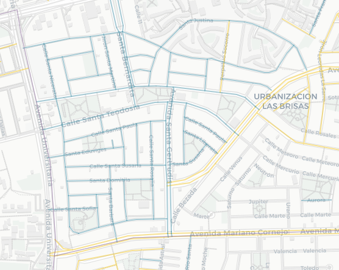
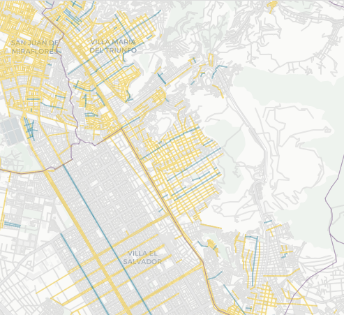

```{r setup, include=FALSE}
knitr::opts_chunk$set(echo = TRUE)
library(sf)
library(leaflet)
library(dplyr)
library(stringr)
library(ggplot2)
library(readr)
```

```{r import-geodata, include=FALSE}
females <-
  st_read("data/gdb_females.geojson", quiet = TRUE) %>% select(3, 4, 22)
males <-
  st_read("data/male_coll_all_simp10.geojson", quiet = TRUE) %>% select(3, 4, 22)
not <-
  st_read("data/not_sel_coll_all_simp10.geojson", quiet = TRUE)
distritos <-
  st_read("data/distritos.geojson", quiet = TRUE) %>% select(1:6) %>% filter(IDDPTO == "07" |
                                                                               IDPROV == "1501")
```

```{r import-data, include=FALSE}
# db_females <- read_csv("gdb_females.csv", col_types = cols(X1 = col_skip(), osm_id = col_skip(), railway = col_skip(), amenity = col_skip(), operator = col_skip(), parking = col_skip(), surface = col_skip(), tunnel = col_skip(), oneway = col_skip(), geometry = col_skip(), bridge = col_skip(), smoothness = col_skip(), width = col_skip(), capacity = col_skip(), layer = col_skip(),  public_tra = col_skip(), aeroway = col_skip(), building = col_skip(),  barrier = col_skip(), names = col_skip(), genero = col_character(),  `_merge` = col_skip()))

db_males <- read_csv("gdb_males.csv", col_types = cols(X1 = col_skip(), osm_id = col_skip(), railway = col_skip(), amenity = col_skip(), operator = col_skip(), parking = col_skip(), surface = col_skip(), tunnel = col_skip(), oneway = col_skip(), geometry = col_skip(), bridge = col_skip(), smoothness = col_skip(), width = col_skip(), capacity = col_skip(), layer = col_skip(),  public_tra = col_skip(), aeroway = col_skip(), building = col_skip(),  barrier = col_skip(), names = col_skip(), genero = col_character(),  `_merge` = col_skip()))

db_not <- read_csv("gdb_not.csv",  col_types = cols(X1 = col_skip(), osm_id = col_skip(), railway = col_skip(), amenity = col_skip(), operator = col_skip(), parking = col_skip(), surface = col_skip(), tunnel = col_skip(), oneway = col_skip(), geometry = col_skip(), bridge = col_skip(), smoothness = col_skip(), width = col_skip(), capacity = col_skip(), layer = col_skip(),  public_tra = col_skip(), aeroway = col_skip(), building = col_skip(),  barrier = col_skip(), names = col_skip(), genero = col_character(),  `_merge` = col_skip()))
```

```{r clean-data, include=FALSE}
females <- females %>%
  filter(!str_detect(name, "Florencia|Cordillera Blanca|Nevado Sara Sara|América|La Luz|Rio Santa|Marbella|Bajada de Agua Dulce|Tingo|La Marina|Libertad|la Marina|Esperanza|Irlanda|Agua Marina|Río Santa|Esmeralda|Villa Maria|Villa María|Las Mercedes|La Victoria|La Merced|Belén|Mayor Arce de la Oliva|Arnaldo Márquez|Belen|Alheli|de las Mercedes|Vila Mercedes|Franciso de Paula Ugarriza|Agua Dulce|Galvez Barrenechea|Pissarro|Stowe|Río Elba|Talavera de la Reina|El Palo Rosa|Laurel Rosa|La Calera de la Merced|Keller|Coral|Arnaldo Panizo|Villa Mercedes|La Estrella|Antinio Bastidas|Aguada Blanca|La Caridad|A La Rosa|Mara Caibo|Mar Coral|San Teresita|Torre Blanca|Bella Luz|Luz de Luna|Rio Elba|Estrella|Torres de la Merced|Merino Reyna Oeste|Estrella Polar|Sara Sara|Señor de la Soledad")) %>% 
  mutate(name = str_replace_all(name, pattern = c('Calle ' = "", 'Pasaje ' = "", 'Avenida ' = "", 
                                                  'Jirón ' = "", 'Av ' = "")))

females_notrel <- females %>% filter(!str_detect(name, "Sor|Santa|Beata|Virgen|sor|santa |beata|virgen|María Auxiliadora"))
females_rel <- females %>% filter(str_detect(name, "Sor|Santa|Beata|Virgen|sor|santa |beata|virgen|María Auxiliadora"))

db_females <- females %>% st_drop_geometry() 
db_males <- db_males %>% select(name, highway, genero) %>% 
  mutate(name = str_replace_all(name, pattern = c('Calle ' = "", 'Pasaje ' = "", 'Avenida ' = "",
                                                                        'Jirón ' = "", 'Av ' = ""))) 
db_not <- db_not %>% select(name, highway, genero) %>% 
  mutate(name = str_replace_all(name, pattern = c('Calle ' = "", 'Pasaje ' = "", 'Avenida ' = "",
                                                                        'Jirón ' = "", 'Av ' = "")))
db_all <- bind_rows(db_females, db_males, db_not)
db_all$genero <- as.factor(db_all$genero)
levels(db_all$genero) <- c("mujeres", "hombres", "ninguno")
```

::: {.bajada}
Menos del 2% de calles de Lima y Callao tienen nombres de mujeres
:::

```{r map, echo = FALSE}
lw <- 3 # set line weight in pixels
lo <- 0.4 # set line opacity
m <- leaflet(width = "100%", options = leafletOptions(minZoom = 10)) %>% 
  setView(-77.022933, -12.068522, zoom = 11) %>%
  setMaxBounds(lng1 = -77.301865, lat1 = -12.525597, lng2 = -76.6, lat2 = -11.56)%>%
  addProviderTiles(providers$CartoDB.Positron) %>% 
  addPolylines(data = not, weight = lw, color = "#D0D0D0", opacity =lo, group = "otras calles") %>%
  addPolylines(data = males, weight = lw, color = "#f1c628", opacity =lo, group = "hombres") %>%
  addPolylines(data = females_rel, weight = lw, color = "#5297ac", opacity =lo, group = "figuras religiosas mujeres", 
               label = females_rel$name) %>%
  addPolylines(data = females_notrel, weight = lw, color = "#5297ac", opacity =lo, group = "mujeres no religiosas", 
               label = females_notrel$name) %>%
  addPolygons( data = distritos, weight = 1, color = "#967aa1", group = "distritos", fill=FALSE) %>%
  addLegend( position = "bottomright", opacity = 0.75, 
             labels = c("calles con nombre de mujer", "calles con nombre de hombre", "otras calles", "límite distrital"),
             colors = c("#5297ac", "#f1c628", "#D0D0D0", "#967aa1")) %>% 
  addLayersControl( overlayGroups = c( "figuras religiosas mujeres", "hombres", "distritos"),
                    options = layersControlOptions( collapsed = FALSE))
```

```{r plot-leaflet, out.width="1000px", echo=FALSE}
m
```

Un vistazo general de la ciudad nos muestra que la cantidad de calles de Lima y Callao que tiene nombres de mujeres es muy baja. Por cada calle que tiene nombre de mujer existen casi 10 calles que tienen nombres de hombres en la ciudad. 

```{r segment-count-plot, fig.height=2, echo=FALSE}
ggplot(db_all, aes(y=factor(1), fill=factor(genero, levels = c("ninguno", "hombres", "mujeres"))))+
  geom_bar(width = 1)+
  scale_fill_manual(values=c("ninguno"= "#808080", "hombres"="#f1c628", "mujeres"= "#5297ac"))+
  theme( text = element_text(family = "Sanchez"),
         panel.grid.major = element_blank(),
         panel.grid.minor = element_blank(),
         panel.background = element_rect(fill = "#f9f7f3"),
         legend.title = element_blank())

# print("proporción de segmentos de mujeres respecto a hombres")
# nrow(db_females)/nrow(db_male)
# print("proporción de segmentos de mujeres respecto al total")
# nrow(db_females)/nrow(db_all)
# print("proporción de segmentos de hombres respecto al total")
# nrow(db_males)/nrow(db_all)
```


```{r plot-freq, echo=FALSE}
f <- db_females %>% group_by(name) %>% summarise(freq=n()) %>% arrange(desc(freq)) %>% slice(1:20)
ggplot(data = f, aes(x = freq, y = reorder(name, freq)))+
    geom_col(fill= "#5297ac")+
    theme(text = element_text(family = "Sanchez"),
          panel.grid.major = element_blank(),
          panel.grid.minor = element_blank(),
          panel.background = element_rect(fill = "#f9f7f3"),
          axis.text = element_text(size= 10))
```


Se pueden ver algunas aglomeraciones de nombres femeninos en la ciudad. La más grande se encuentra en los barrios de Pando y Santa Emma, frente a la Universidad Católica. En poco más de medio kilómetro cuadrado se encuentran un par de decenas de calles con nombres de mujeres, sin embargo todas ellas tienen nombres de santas. El parque más grande del barrio, entre las calles Santa Teodosia y Santa Mariana, se llama Carlos. Otras aglomeraciones con nombres de santas se encuentran en Palao y San Diego (San Martín de Porres), Los Sauces (Ate) e Infantas (Los Olivos).

  

Otra aglomeración ocurre en la urbanización Los Rosales, en Surco. En este caso se trata de un grupo de nombres genéricos de mujeres que no representan a ningún personaje (Doña Rosa, Doña Ana, Doña Luisa). La etimología de "doña" refiere a "domina" (dueña de casa), y la palabra solía hacer referencia a una mujer casada. 

  

Las dos aglomeraciones más grandes de calles con nombres de mujeres rescatan principalmente dos aspectos: el religioso/la santidad y la dimensión doméstica/el rol de esposa.

En el cono sur aparecen algunos nombres más cercanos al Perú y su historia. Las dos largas avenidas de Villa El Salvador son Micaela Bastidas y María Elena Moyano. En Villa María del Triunfo se encuentran, además de Micaela, María Parado de Bellido, Flora Tristan, Mama Ocllo, Juana Alarco de Dammert, Rosa Merino, Marian Quimper (?). San Juan de Miraflores tiene también una calle dedicada a Violeta Parra. 

 

La longitud promedio de las calles con nombres es de 2.5 km  mientras que las de mujeres es de 0.2 km. 
Los dos clusters más notorios de nombres femeninos en la ciudad, son el de Pando y Santa Emma, en el Cercado de Lima, y el de la urbanización Los Rosales, en Santiago de Surco. Sin embargo, el primero solo tiene nombres de santas, y el segundo nombres de mujeres genéricas (Doña Rosa, Doña Amalia, etc.).
Existen distritos que no tienen calles con nombres de mujeres.

```{r}
```


## créditos, fuentes y metodología
Esta es una idea original de Carla Solis

Los datos de OSM organizan las calles en segmentos
La calles fueron descargadas de OSM. Para averiguar si los nombres de las calles corresponden a personas se hizo....