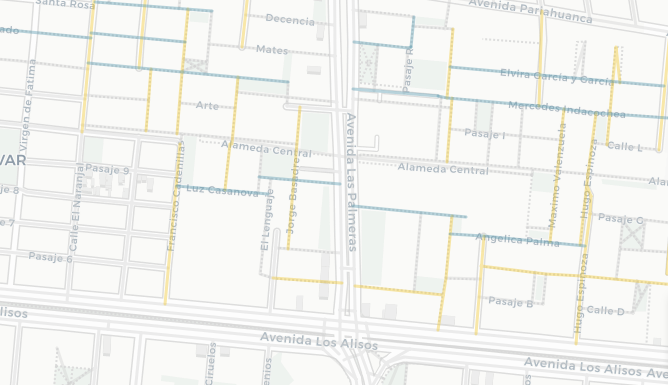

```{r setup, include=FALSE}
knitr::opts_chunk$set(echo = TRUE)
library(sf)
library(leaflet)
library(dplyr)
library(stringr)
library(ggplot2)
library(readr)
```

```{r import-geodata, include=FALSE}
females <-
  st_read("data/gdb_females.geojson", quiet = TRUE) %>% select(3, 4, 22)
males <-
  st_read("data/male_coll_all_simp10.geojson", quiet = TRUE) %>% select(3, 4, 22)
not <-
  st_read("data/not_sel_coll_all_simp10.geojson", quiet = TRUE)
distritos <-
  st_read("data/distritos.geojson", quiet = TRUE) %>% select(1:6) %>% filter(IDDPTO == "07" |
                                                                               IDPROV == "1501")
```

```{r import-data, include=FALSE}
# db_females <- read_csv("gdb_females.csv", col_types = cols(X1 = col_skip(), osm_id = col_skip(), railway = col_skip(), amenity = col_skip(), operator = col_skip(), parking = col_skip(), surface = col_skip(), tunnel = col_skip(), oneway = col_skip(), geometry = col_skip(), bridge = col_skip(), smoothness = col_skip(), width = col_skip(), capacity = col_skip(), layer = col_skip(),  public_tra = col_skip(), aeroway = col_skip(), building = col_skip(),  barrier = col_skip(), names = col_skip(), genero = col_character(),  `_merge` = col_skip()))

db_males <- read_csv("gdb_males.csv", col_types = cols(X1 = col_skip(), osm_id = col_skip(), railway = col_skip(), amenity = col_skip(), operator = col_skip(), parking = col_skip(), surface = col_skip(), tunnel = col_skip(), oneway = col_skip(), geometry = col_skip(), bridge = col_skip(), smoothness = col_skip(), width = col_skip(), capacity = col_skip(), layer = col_skip(),  public_tra = col_skip(), aeroway = col_skip(), building = col_skip(),  barrier = col_skip(), names = col_skip(), genero = col_character(),  `_merge` = col_skip()))

db_not <- read_csv("gdb_not.csv",  col_types = cols(X1 = col_skip(), osm_id = col_skip(), railway = col_skip(), amenity = col_skip(), operator = col_skip(), parking = col_skip(), surface = col_skip(), tunnel = col_skip(), oneway = col_skip(), geometry = col_skip(), bridge = col_skip(), smoothness = col_skip(), width = col_skip(), capacity = col_skip(), layer = col_skip(),  public_tra = col_skip(), aeroway = col_skip(), building = col_skip(),  barrier = col_skip(), names = col_skip(), genero = col_character(),  `_merge` = col_skip()))
```

```{r clean-data, include=FALSE}
females <- females %>%
  filter(!str_detect(name, "Florencia|Cordillera Blanca|Nevado Sara Sara|América|La Luz|Rio Santa|Marbella|Bajada de Agua Dulce|Tingo|La Marina|Libertad|la Marina|Esperanza|Irlanda|Agua Marina|Río Santa|Esmeralda|Villa Maria|Villa María|Las Mercedes|La Victoria|La Merced|Belén|Mayor Arce de la Oliva|Arnaldo Márquez|Belen|Alheli|de las Mercedes|Vila Mercedes|Franciso de Paula Ugarriza|Agua Dulce|Galvez Barrenechea|Pissarro|Stowe|Río Elba|Talavera de la Reina|El Palo Rosa|Laurel Rosa|La Calera de la Merced|Keller|Coral|Arnaldo Panizo|Villa Mercedes|La Estrella|Antinio Bastidas|Aguada Blanca|La Caridad|A La Rosa|Mara Caibo|Mar Coral|San Teresita|Torre Blanca|Bella Luz|Luz de Luna|Rio Elba|Estrella|Torres de la Merced|Merino Reyna Oeste|Estrella Polar|Sara Sara|Señor de la Soledad|Puente America|America Unamarca|Palmira|Merced|Cristal|Meier|Merced|Cerro Paloma|J.C. María Tegui|El Dulce|Cielo Punko|Caridad|Azucena|La Veronica|María Tegui|Iris|Arnaldo Marquez|Arco Iris|Margarita|La Perla|Fatima|Isis|Barrenechea|Reyna Talavera|America|Soledad|La Soledad|Las Nieves|Alma")) %>% 
  mutate(name = str_replace_all(name, pattern = c('Calle ' = "", 'Pasaje ' = "", 'Avenida ' = "", 'Jirón ' = "", 'Av ' = "", 'Malecón ' = "", 'Malecon ' = "", 'Salida a ' = "", 'Puente ' = "", 'Alameda ' = "", 'Ovalo ' = "" )))

females_notrel <- females %>% filter(!str_detect(name, "Sor|Santa|Beata|Virgen|sor|santa |beata|virgen|María Auxiliadora"))
females_rel <- females %>% filter(str_detect(name, "Sor|Santa|Beata|Virgen|sor|santa |beata|virgen|María Auxiliadora"))

db_females <- females %>% st_drop_geometry() 
db_males <- db_males %>% select(name, highway, genero) %>% 
  mutate(name = str_replace_all(name, pattern = c('Calle ' = "", 'Pasaje ' = "", 'Avenida ' = "", 'Jirón ' = "", 'Av ' = "", 'Malecón ' = "", 'Malecon ' = "", 'Salida a ' = "", 'Puente ' = "", 'Alameda ' = "", 'Ovalo ' = "" ))) 
db_not <- db_not %>% select(name, highway, genero) %>% 
  mutate(name = str_replace_all(name, pattern = c('Calle ' = "", 'Pasaje ' = "", 'Avenida ' = "", 'Jirón ' = "", 'Av ' = "", 'Malecón ' = "", 'Malecon ' = "", 'Salida a ' = "", 'Puente ' = "", 'Alameda ' = "", 'Ovalo ' = "" )))
db_all <- bind_rows(db_females, db_males, db_not)
db_all$genero <- as.factor(db_all$genero)
levels(db_all$genero) <- c("mujeres", "hombres", "ninguno")
```

::: {.bajada}
Menos del 2% de las calles de Lima y Callao tienen nombre de mujeres ¿dónde están esas calles? ¿quiénes son esas mujeres? ¿qué roles representan? Acompañanos en este recorrido por la ciudad y las mujeres que nombran sus calles.
:::

```{r map, echo = FALSE}
lw <- 3 # set line weight in pixels
lo <- 0.4 # set line opacity
m <- leaflet(width = "100%", options = leafletOptions(minZoom = 10)) %>% 
  setView(-77.022933, -12.068522, zoom = 11) %>%
  setMaxBounds(lng1 = -77.301865, lat1 = -12.525597, lng2 = -76.6, lat2 = -11.56)%>%
  addProviderTiles(providers$CartoDB.Positron) %>% 
  addPolylines(data = not, weight = lw, color = "#D0D0D0", opacity =lo, group = "otras calles") %>%
  addPolylines(data = males, weight = lw, color = "#f1c628", opacity =lo, group = "hombres") %>%
  addPolylines(data = females_rel, weight = lw, color = "#5297ac", opacity =lo, group = "figuras religiosas mujeres", 
               label = females_rel$name) %>%
  addPolylines(data = females_notrel, weight = lw, color = "#5297ac", opacity =lo, group = "mujeres no religiosas", 
               label = females_notrel$name) %>%
  addPolygons( data = distritos, weight = 1, color = "#967aa1", group = "distritos", fill=FALSE) %>%
  addLegend( position = "bottomright", opacity = 0.75, 
             labels = c("calles con nombre de mujer", "calles con nombre de hombre", "otras calles", "límite distrital"),
             colors = c("#5297ac", "#f1c628", "#D0D0D0", "#967aa1")) %>% 
  addLayersControl( overlayGroups = c( "figuras religiosas mujeres", "hombres", "distritos"),
                    options = layersControlOptions( collapsed = FALSE))
```

```{r plot-leaflet, out.width="1000px", echo=FALSE}
m
```

Un vistazo general de la ciudad nos muestra que la cantidad de calles de Lima y Callao que tiene nombres de mujeres es muy baja. Por cada calle que tiene nombre de mujer existen casi 10 calles que tienen nombres de hombres en la ciudad. 

```{r segment-count-plot, fig.height=2, echo=FALSE}
ggplot(db_all, aes(y=factor(1), fill=factor(genero, levels = c("ninguno", "hombres", "mujeres"))))+
  geom_bar(width = 1)+
  scale_fill_manual(values=c("ninguno"= "#808080", "hombres"="#f1c628", "mujeres"= "#5297ac"))+
  theme( text = element_text(family = "Sanchez"),
         panel.grid.major = element_blank(),
         panel.grid.minor = element_blank(),
         panel.background = element_rect(fill = "#f9f7f3"),
         legend.title = element_blank())

# print("proporción de segmentos de mujeres respecto a hombres")
# nrow(db_females)/nrow(db_male)
# print("proporción de segmentos de mujeres respecto al total")
# nrow(db_females)/nrow(db_all)
# print("proporción de segmentos de hombres respecto al total")
# nrow(db_males)/nrow(db_all)
```

A pesar de que son pocas, se notan algunas aglomeraciones de calles de mujeres. Pando 3era etapa (frente a la PUCP), Los Rosales (Surco), Palao y San Diego (San Martín de Porres), Los Sauces (Ate), Infantas (Los Olivos) y otras.  

  

  

  

   
  
La algomeración más grande es la de Pando 3era etapa en Cercado de Lima. Medio km2 de calles con nombres de Santas (Santa Teodosia, Santa Gertrudis, Santa Bernardita, etc.) El parque más grande del barrio tiene nombre de hombre: Carlos. Otras aglomeraciones de cierto tamaño en SMP, Ate y los Olivos también corresponden únicamente a nombres de santas.  

  

La segunda aglomeración más grande es la urb. Los Rosales (Surco). Este es el barrio de las "doñas" (Doña Rosa, Doña Amalia, Doña Juana...). La etimología de “doña” refiere a “domina” (señora, dueña de casa), y probablemente cuando la escuchamos pensamos en una mujer casada.  

  

Es revelador que las dos aglomeraciones más grandes de calles con nombres de mujeres rescatan principalmente dos dimensiones: la religiosa/la santidad y la doméstica/el rol de esposa. La presencia de figuras religiosas es muy fuerte entre las calles de Lima y Callao que tienen nombre de mujer. Fíjate cómo cambia nuestro mapa interactivo cuando desactivas los nombres de personajes religiosas. De hecho, [este  reportaje de RPP y Melissa Barrenechea](https://rpp.pe/p/1027018) muestra que el 57% de calles de mujeres en Lima corresponde a figuras del ámbito religioso.  y nos cuenta un poco sobre ls ocupaciones de las mujeres representadas en nuestras calles.  


  

Nosotros encontramos, usando el conteo de segmentos (una calle puede estar conformada por más de un segmento, dependiendo de su longitud, número de carriles, acceso, entre otros), que entre las 20 mujeres más usadas para nombrar calles 11 son santas (Santa Rosa de Lima es, por mucho, la principal). Las demás son mujeres vinculadas a la independencia, con excepción de Flora Tristán. También encontramos, además, que las calles de Lima y Callao mencionan a 138 figuras religiosas mujeres y 261 mujeres de otros ámbitos.  

```{r plot-freq, echo=FALSE}
f <- db_females %>% group_by(name) %>% summarise(freq=n()) %>% arrange(desc(freq)) %>% slice(1:20)
ggplot(data = f, aes(x = freq, y = reorder(name, freq)))+
    geom_col(fill= "#5297ac")+
    theme(text = element_text(family = "Sanchez"),
          panel.grid.major = element_blank(),
          panel.grid.minor = element_blank(),
          panel.background = element_rect(fill = "#f9f7f3"),
          axis.text = element_text(size= 10))
```
  
¿Pero además de religiosas, a qué otras mujeres reconocemos en nuestros barrios? Uno de los vecindarios más interesantes es Pando 7ma Etapa (San Miguel, alrededor de av. Universitaria, entre La Marina y la Costanera). Aquí encontramos un grupo de notables mujeres que te invitamos a conocer: Margarita Praxedes (pionera del feminismo peruano), Martha Egúsquiza, Beatriz Cisneros, María Escobar, Luisa Dammert (promotora del voto femenino en XXX)...  

  

Cerca del Óvalo Naranjal, en Los Olivos, hay otro pequeño grupo notable de calles, en este caso de mujeres vinculadas a la educación, donde se encuentran Elvira García, Mercedes Indacochea, Teresa Gonzáles de Fanning y Esther Salgado, entre otras.  

  

Otro caso interesante es el de Villa el Salvador, que aunque no tiene muchas calles con nombre de mujer, tiene 3 largas avenidas en reconocimiento de Micaela Bastidas, María Reiche y María Elena Moyano, esta última estrechamente vinculada a la historia del distrito.  


También llama la atención que en la supuesta "Lima Moderna" hay muy pocas calles con nombre de mujer: solmente 1 en Jesús María; 3 en Miraflores, Lince, Magdalena y Barranco; y 8 en  San Isidro (que se reducen a casi la mitad si no contamos santas). Además, casi ninguna de estas mujeres fue vecina o está relacionada con la historia del distrito.

Nombrar una calle suele significar un reconocimiento a lugares, personas o hechos que queremos mantener en nuestra memoria colectiva y preservar en el tiempo. ¿A cuántas mujeres hemos reconocido en 490 años de fundación española? ¡Menos de una por año!

Tenemos muchísimas mujeres con trayectorias destacadas en todos los distritos de nuestra ciudad. Nos toca exigir a nuestras autoridades que sean reconocidas y que tengamos más espacios para recordarlas y resaltar su importancia en nuestra sociedad. Seguramente conoces muchas mujeres que merecen una calle. ¡Cuéntanos quiénes serían!


## créditos, fuentes y metodología  
Este mapa fue una idea de [Carla Solís]() ejecutada por ella y el equipo de [desarro.io](desaro.io). Los nombres de calles son de @openstreetmap 🔎, el mapa se hizo con @leafletJS 🍃 y tiles 🗺️ de @carto.
