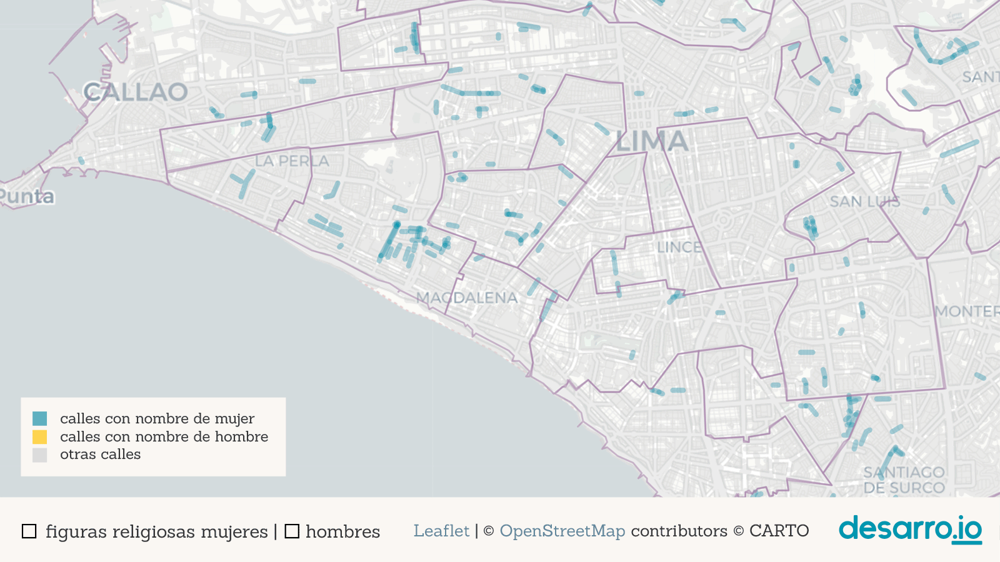
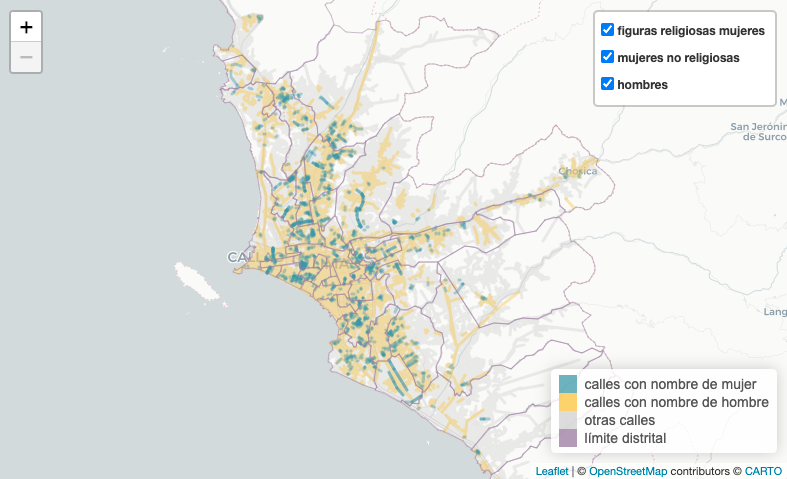
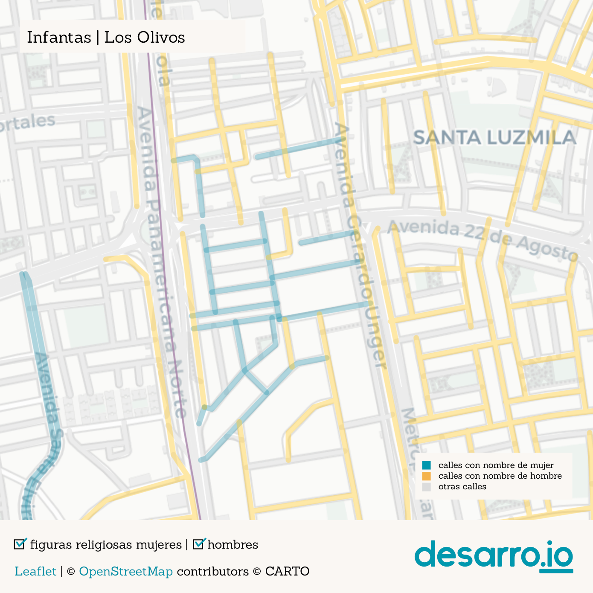
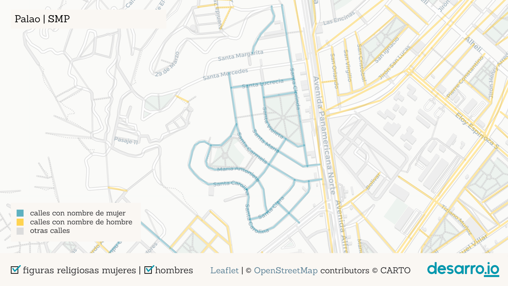
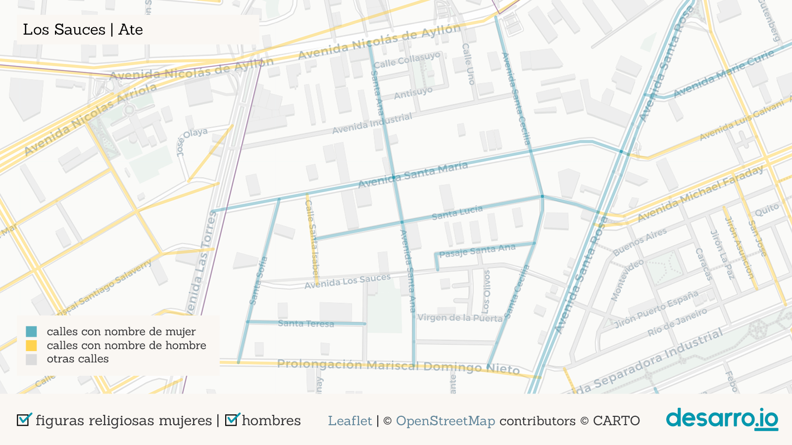
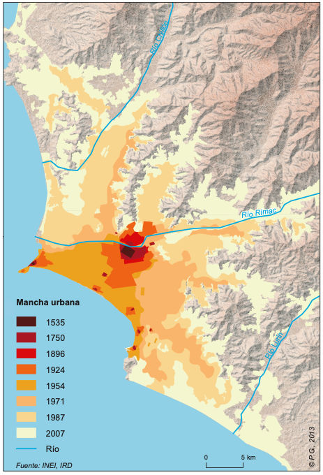

# Tweet

1  
Son pocas las calles de Lima y Callao a las que se les asignaron nombres de mujeres. ¿Dónde están esas calles? ¿quiénes son esas mujeres? ¿qué roles representan? Acompáñanos en este recorrido por la ciudad y las mujeres nombradas en sus calles.

   
  
2  
Existe un patrón en la asignación de calles de Lima y Callao: las mujeres no son tan celebradas como los hombres. En nuestro recuento encontramos que las calles de la ciudad rinden homenaje a 3448 hombres y solo a 406 mujeres. Más de 8 hombres por cada mujer. Aquí algunos nombres frecuentes👇  

   

3  
¿Quiénes eligieron estos nombres y por qué? 🙄 Fíjate que son muy pocas las calles en azul (mujeres) en comparación con las amarillas (hombres). Las calles grises no representan nombres de personas.

   

4  
Encontramos algunas aglomeraciones de calles que recibieron nombres de mujeres 🔎: Pando 3era etapa (frente a la @pucp), Los Rosales (@munisurco1), Palao y San Diego (@Munismp), Los Sauces (@MuniAteOficial), Infantas (Los Olivos) y otras.  

  

  

  

   

4  
Una de las más grandes es la aglomeración en Pando 3era etapa, en Cercado de @munilima. 1/2 km2 de calles de nombres de santas (Santa Teodosia, Santa Gertrudis, Santa Bernardita, etc.) Sin embargo, al parque más grande del barrio se le asignó a un nombre masculino y laico: Carlos. 😑  

  

5  
Otras pequeñas aglomeraciones de calles con nombres femeninos aparecen en San Martín de Porres, Ate y Los Olivos pero corresponden otra vez a nombres de santas.

  
  

6  
La segunda aglomeración más grande está en la urb. Los Rosales (@munisurco1). Este es el barrio de las "doñas" (Doña Rosa, Doña Amalia, Doña Juana...). La etimología de “doña” viene del latin “domina” (dueña de casa, mujer casada), y ninguna de ellas tiene apellido.  

7  
Es revelador que dos de las aglomeraciones más grandes de calles nombradas como mujeres en la ciudad rescatan principalmente dos dimensiones: la religiosa/la santidad ⛪ y la doméstica/el rol de esposa 🏠. 

8  
Existe una fuerte presencia de calles con nombres femeninos de religiosas entre las calles de @MuniLima y @RegionCallaoPe. Fíjate cómo cambia nuestro mapa interactivo cuando desactivamos los nombres de mujeres religiosas.

9  
De hecho, el 39% de mujeres mencionadas en calles de Lima corresponde a santas, mientras que en el caso de los hombres, solamente el 5% son santos, lo que nos muestra que la valoración de las ocupaciones masculinas y femeninas es diferente.

10  
@M_Barrenechea de @rpp_pe mostró que la mayoría de calles de Lima nombradas como mujeres corresponde a figuras del ámbito religioso, seguidas de lejos por: patriotas del movimiento independentista, escritoras, educadoras, artistas, figuras del imperio incaico, entre otras https://rpp.pe/p/1027018

10  
Además de religiosas, ¿qué otros aportes de las mujeres son reconocidas en las calles? Fijémonos en Pando 7ma Etapa (@Muni_San_Miguel cerca de av. Universitaria, y La Marina).  

11  
En este barrio se concentran varias calles con nombres de mujeres notables que te invitamos a conocer: Margarita Práxedes (pionera del feminismo peruano)y Luisa Dammert (promotora del voto femenino a inicios del s. XX). 

12
Además de ellas se encuentran también: Martha Egúsquiza, Beatriz Cisneros, María Escobar, entre otras. Ninguna está reseñada en Wikipedia. 😑

12  
Cerca del Óvalo Naranjal hay un pequeño grupo de calles con nombres de mujeres activistas por la educación de la mujer peruana, como Elvira García, Mercedes Indacochea, Teresa Gonzáles de Fanning y Esther Salgado.

13  
Otro caso destacable es el de @VesMuni, que tiene 3 largas avenidas en memoria a Micaela Bastidas, María Reiche y María Elena Moyano, esta última estrechamente vinculada a la historia del distrito. Sin embargo, en el mismo distrito hay pocas calles a las que se les otorgó nombre de mujer.

14  
También llama la atención que en la supuesta "Lima Moderna" existan pocas calles designadas con nombres de mujeres: solamente 1 en @munijesusmaria; 3 en @Munimiraflores, @muni_lince, @MuniDeMagdalena y @munibarranco; 8 en @munisanisidro. Sin contar santas, el número sería casi la mitad.

16
Al nombrar una calle creamos una narrativa de cómo es un lugar: le damos carácter y recordamos la historia. ¿A cuántas mujeres nos invita a recordar Lima? En 200 años de independencia asignamos menos de dos nombres femeninos por año. ¡Menos de una por año desde su fundación en 1532!

18
Comparando con la expansión de la ciudad (Metzger y otros, 2015) vemos que la ciudad urbanizada hasta los 50's tiene muchos nombres de personas, principalmente hombres, pero la ciudad más nueva parece optar por nombres más neutrales (fechas, lugares, números, plantas, profesiones...)  

17  
En el Perú y el mundo existe una larga lista de mujeres excepcionales y de trayectorias destacadas que urge visibilizar y recordar. Nos toca exigir a las autoridades que sean reconocidas en los espacios públicos y resaltar sus aportes a la sociedad.

18  
Explora las calles asignadas con nombre de mujer en tu barrio. Fíjate cuáles son en nuestro mapa interactivo aquí 👉 https://desarroio.github.io/genero-calles/
¿Qué nombres de mujeres peruanas quisieras ver en una calle? ¡Cuéntanos quiénes serían!

19  
Este mapa fue una idea de @odaltomate 👏 y ejecutada junto al equipo de @desarro_io 🤝. Los nombres de calles son de @openstreetmap 🔎, el mapa se hizo con @leafletJS 🍃 y tiles 🗺️ de @carto. 

20  
Si te interesó el tema date una vuelta por "Las calles de las mujeres" de @geochicas, que identifican las calles en distintas ciudades latinoamericanas 👏👏👏 y enlaza a las biografías disponibles en Wikipedia 👍

21
y revisa también el libro "Mujeres con Calle", en el que alumnes del colegio José Antonio Encinas recopilan biografías sobre Mariana Echevarría, Justa García Robledo, Ernestina Zamorano y Bartola Sánchez Dávila. https://issuu.com/elingeniosocorreo/docs/mujeres_con_calle

22
El mapa de la expansión de Lima es de Metzger, P., Gluski, P., Robert, J., & Sierra, A. (2015). Atlas problemático de una metrópoli vulnerable. Desigualdades urbanas en Lima y Callao. Lima: @IFEAPeru. https://www.ifea.org.pe/libreria/travaux/331/pdf/atlas-problematico-es.pdf

# La yapa

18  
'Los nombres de las calles despliegan una “política de la memoria” orientada a que la ciudadanía guarde recuerdo y agradezca a sus compatriotas más ilustres...' Dice Gonzalo Portocarrero https://elcomercio.pe/opinion/columnistas/nombres-calles-gonzalo-portocarrero-noticia-lima-calles-avenidas-479334-noticia/

19
Y además de sesgos de género, los nombres de calles pueden mostrar también la falta de reconocimiento de algunos sectores de la sociedad en detrimento de otros. El propio Gonzalo señala una "relativa ausencia de personajes andinos" y señala también

20
la persistencia de una calle como Los Conquistadores, en @munisanisidro, que "supone una identificación con una tropa de invasores y saqueadores que pretendieron convertirse en los dueños del Tahuantinsuyo".

21 Fuera del país, @TheMelBanci y otros exploran también sesgos de género, identifican las profesiones consideradas de élite y la influencia del extranjero en Paris, Viena, Londres y Nueva York, a partir del análisis de los nombres de las calles.

20 y @Deirdre_Mask en su libro "The Adress Book" muestra casos alrededor del mundo sobre como los nombres de calles premiten observar también sesgos de clase o raza, estigmatización, identidad y poder https://www.deirdremask.com/. 

