# Tweet

1  
Menos del 2% de las calles de Lima y Callao tienen nombre de mujeres. ¿Dónde están esas calles? ¿quiénes son esas mujeres en nuestra historia? ¿qué roles representan? Acompáñanos en este recorrido por la ciudad y las mujeres que nombran sus calles.  

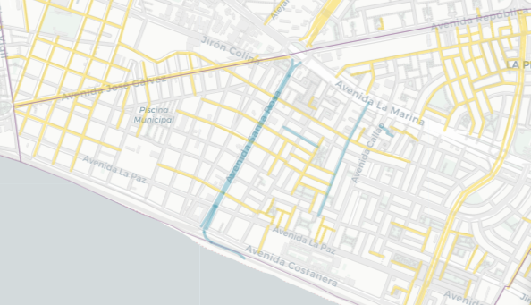   
  
2  
Por cada calle con nombre de mujer hay casi 10 nombradas como hombres 🙄. Fíjate que son muy pocas las calles en azul (mujeres) en comparación con las amarillas (hombres). Las calles grises no representan nombres de personas.  

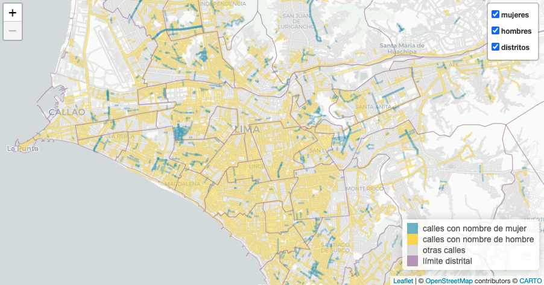   

3  
A pesar de que son pocas, se notan algunas aglomeraciones de calles de mujeres 🔎. Pando 3era etapa (frente a la @pucp), Los Rosales (@munisurco1), Palao y San Diego (@Munismp), Los Sauces (@MuniAteOficial), Infantas (Los Olivos) y otras.  

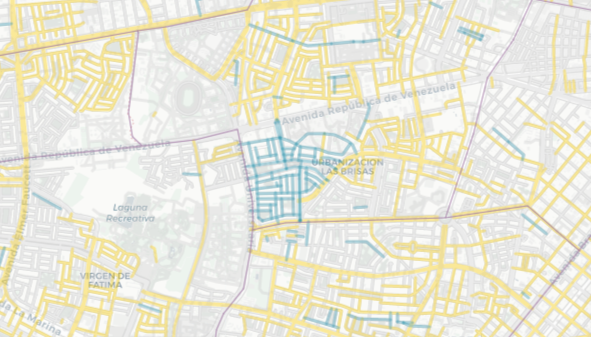  

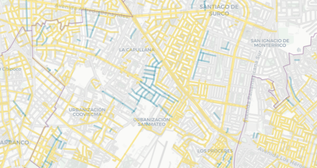  

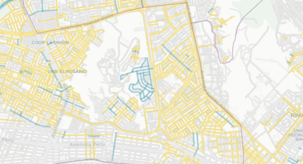  

   

4  
La aglomeración más grande es la de Pando 3era etapa en Cercado de @munilima. Medio km2 de calles con nombres de santas (Santa Teodosia, Santa Gertrudis, Santa Bernardita, etc.), pero el parque más grande del barrio tiene nombre de hombre: Carlos. 😑  

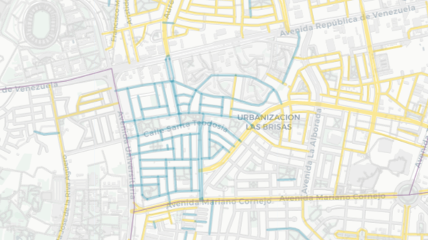  

5  
Otras pequeñas aglomeraciones en San Martín de Porres, Ate y Los Olivos también corresponden únicamente a nombres de santas.

6  
La segunda aglomeración más grande está en la urb. Los Rosales (@munisurco1). Este es el barrio de las "doñas" (Doña Rosa, Doña Amalia, Doña Juana...). La etimología de “doña” refiere a “domina” (señora, dueña de casa), y probablemente cuando la escuchamos pensamos en una mujer casada.  

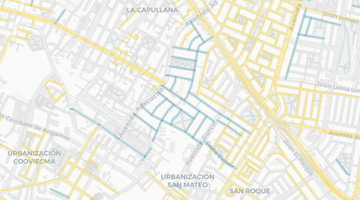

7  
Es revelador que las dos aglomeraciones más grandes de calles con nombres de mujeres en la ciudad rescatan principalmente dos dimensiones: la religiosa/la santidad ⛪ y la doméstica/el rol de esposa 🏠. 

8  
La presencia de figuras femeninas religiosas es muy fuerte entre las calles de @MuniLima y @RegionCallaoPe que tienen nombre de mujer. Fíjate cómo cambia nuestro mapa interactivo cuando desactivamos los nombres de personajes religiosas

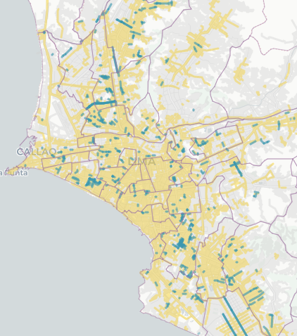

9 
De hecho, este interesante reportaje de @rpp_pe y @M_Barrenechea muestra que el 57% de calles nombradas como mujeres en Lima corresponde a figuras del ámbito religioso. https://rpp.pe/p/1027018 y nos cuenta un poco sobre las ocupaciones de las mujeres representadas en nuestras calles.

10 [Creo que este no va, a menos que se resuelva bien lo de los segmentos. Además habría que eliminar angelica gamarra que es en realidad una sola calle]  
Entre las 20 mujeres más usadas para nombrar calles (conteo de segmentos) 11 son santas (Santa Rosa de Lima es la principal). Las demás son mujeres vinculadas a la independencia, con excepción de Flora Tristán.  

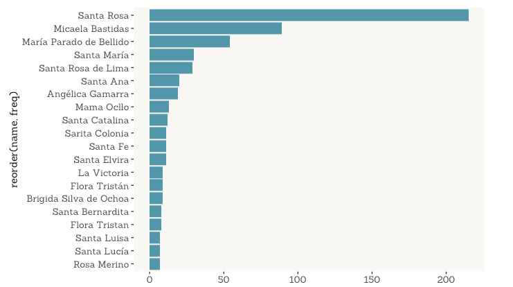  

11 [Creo que este no va, a menos que se filtre mejor ya que el número de mujeres únicas está sobreestimado en este calculo]  
También encontramos, además, que las calles de Lima y Callao mencionan a 138 figuras religiosas mujeres y 261 mujeres de otros ámbitos.

11  
¿Pero además de religiosas, qué otras mujeres son reconocidas en nuestros barrios? Uno de los vecindarios más interesantes es Pando 7ma Etapa (@Muni_San_Miguel cerca de av. Universitaria, y La Marina)...
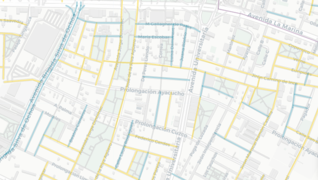

12  
En este barrio encontramos un grupo de notables mujeres que te invitamos a conocer: Margarita Práxedes (pionera del feminismo peruano), Martha Egúsquiza, Beatriz Cisneros, María Escobar, Luisa Dammert (promotora del voto femenino en XXX)...

13  
Cerca del Óvalo Naranjal hay otro pequeño grupo notable de calles, en este caso de mujeres vinculadas a la educación, donde se encuentran Elvira García, Mercedes Indacochea, Teresa Gonzáles de Fanning y Esther Salgado.
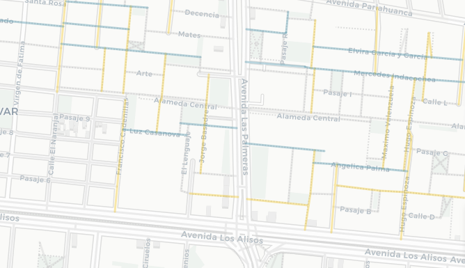

14  
Otro caso interesante es el de @VesMuni, que aunque no tiene muchas calles con nombre de mujer, tiene 3 largas avenidas en memoria de Micaela Bastidas, María Reiche y María Elena Moyano, esta última estrechamente vinculada a la historia del distrito.
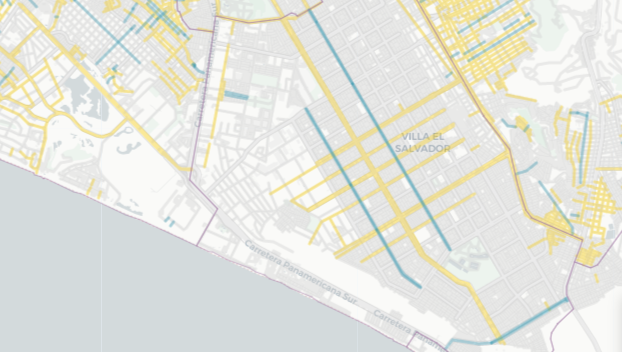

15  
También llama la atención que en la supuesta "Lima Moderna" haya muy pocas calles con nombre de mujer: solamente 1 en @munijesusmaria; 3 en @Munimiraflores, @muni_lince, @MuniDeMagdalena y @munibarranco; 8 en @munisanisidro (que, sin contar santas, se reducen a casi la mitad)

16  
Nombrar una calle es honrar lugares, personas, hechos o cosas que queremos mantener en nuestra memoria colectiva y preservar en el tiempo. ¿A cuántas mujeres ha reconocido Lima en sus 490 años de fundación española? ¡Menos de una por año!

17  
El Perú y el mundo tienen muchísimas mujeres con trayectorias destacadas que merecen ser recordadas. Muchas de ellas, además, son de nuestra ciudad y nuestros distritos. Nos toca exigir a nuestras autoridades que sean reconocidas y que tengamos más espacios para recordarlas y resaltar su importancia en nuestra sociedad.

Comparando con la expansión de la ciudad (Metzger y otros, 2015) vemos que la ciudad urbanizada hasta los 50 tiene muchos nombres de personas, principalmente hombres, pero la ciudad más nueva parece optar nombres más neutrales (fechas, lugares, números, plantas, profesiones...)  

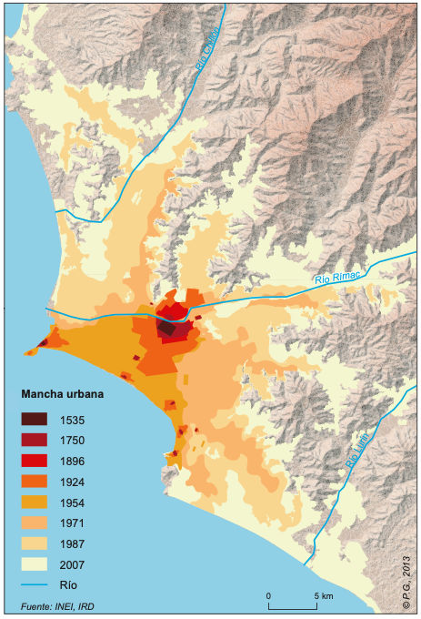

18  
¿Quieres ver si hay calles con nombre de mujer por tu barrio? Fíjate cuáles son en nuestro mapa interactivo aquí 👉 [LINK]
Seguramente conoces muchas mujeres que merecen una calle. ¡Cuéntanos quiénes serían!

19  
Este mapa fue una idea de @odaltomate 👏 y ejecutada junto al equipo de @desarro_io 🤝. Los nombres de calles son de @openstreetmap 🔎, el mapa se hizo con @leafletJS 🍃 y tiles 🗺️ de @carto. 

Referencias
Metzger, P., Gluski, P., Robert, J., & Sierra, A. (2015). Atlas problemático de una metrópoli vulnerable. Desigualdades urbanas en Lima y Callao. Lima: @IFEAPeru. https://www.ifea.org.pe/libreria/travaux/331/pdf/atlas-problematico-es.pdf

Referencias:

Luisa Dammert:
https://www.mimp.gob.pe/webs/mimp/sispod/pdf/89.pdf 
https://blog.derrama.org.pe/y-quien-fue-juana-alarco-de-dammert/

Práxedes
https://revistas.upch.edu.pe/index.php/AH/article/view/4021

