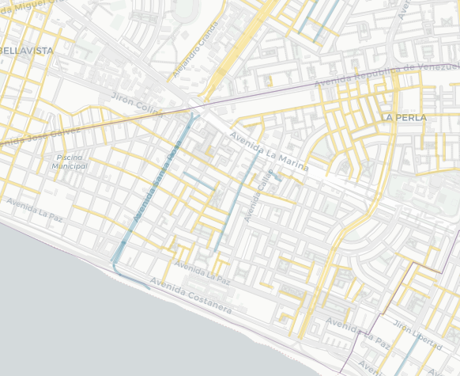

# Tweet

Alrededor del 1% de las calles de Lima y Callao tienen nombre de mujeres (en azul) ¿dónde están esas calles? ¿quiénes son esas mujeres? ¿qué roles representan? Acompañanos en este recorrido por la ciudad y las mujeres que nombran sus calles.
   

Las calles que tienen nombres de mujeres son menos del 1% del total de calles y por cada calle nombrada como mujer hay más de 100 nombradas como hombres. Azul -> calles con nombres de mujere, amarillo -> calle con nombre de hombres. Las calles grises no representan personas.
[mapa completo]

A pesar de que son pocas, se notan algunas aglomeraciones de calles de mujeres. Pando (frente a la @pucp) Los Rosales (Surco), Palao y San Diego (SMP), Los Sauces (Ate) e Infantas (Los Olivos).
[zoom in con anotación]

La algomeración más grande es la de Pando 3era etapa. Medio km2 de calles con nombres de Santas (Santa Teodosia, Santa Gertrudis, Santa Bernardita, etc.) El parque más grande del barrio tiene nombre de hombre: Carlos. 😑
[zoom in Pando]

Los otros "clusters" de SMP, Ate y los Olivios también corresponden únicamente a nombres de mujeres.

La segunda aglomeración más grande es la urb. Los Rosales. Este es el barrio de las "doñas" (Doña Rosa, Doña Amalia, Doña Juana, Doña Virginia...) La etimología de “doña” refiere a “domina” (señora, dueña de casa), y probablemente la asociamos a una mujer casada.

Es revelador que las dos aglomeraciones más grandes de calles con nombres de mujeres rescatan principalmente dos dimensiones: la religiosa/la santidad y la doméstica/el rol de esposa.

La aglomeración más interesante la de Pando 7ma Etapa (alrededor de av. Universitaria, entre La Marina y la Costanera). Brígida Silva (patriota), Margarita Praxedes (pionera del feminismo peruano), Martha Egúsquiza, Beatriz Cisneros, María Escobar, Luisa Dammert(miembro de )...

Nombrar una calle suele significar un reconocimiento a lugares, personas o hechos que queremos mantener en nuestra memoria colectiva, preservar en el tiempo. En 490 años de fundación española hemos considerado que solo X mujeres merecen ser recordadas en calles.
[nombres únicos de mujeres vs hombres]

Las calles que hemos bautizado como mujeres, además, tienen una extensión media de XXXX km, mientras que las llamadas como hombres, xxxxxx. km. 
[distribuciones comparadas?]

Villa El Salvador tiene 3 de las X calles más largas con nombre de mujer: Micaela Bastidas - que encabeza el top de no religiosas, María Reiche y María Elena Moyano. VES es de los pocos distritos que ha reconocido con una avenida principal a una de sus vecinas más ilustres.
[zoom in + foto?]

Referencias:

Luisa Dammert:
https://www.mimp.gob.pe/webs/mimp/sispod/pdf/89.pdf 
https://blog.derrama.org.pe/y-quien-fue-juana-alarco-de-dammert/

Práxedes
https://revistas.upch.edu.pe/index.php/AH/article/view/4021

