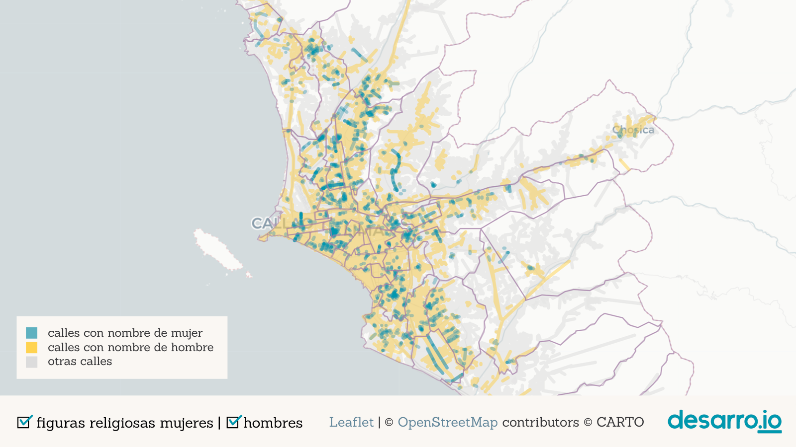
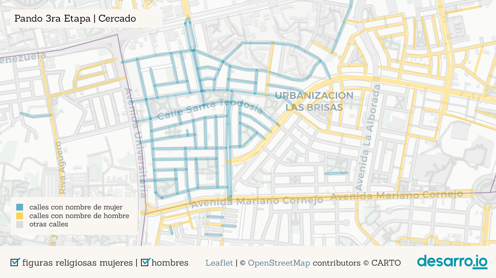

# Tweet

1
Solo 406 mujeres tienen calles designadas con sus nombres en Lima y Callao. ¿Dónde están esas calles? ¿quiénes son esas mujeres? ¿qué roles representan? Acompáñanos en este recorrido por la ciudad y las calles que llevan sus nombres. #8M #DíaInternacionaldelaMujer

   
  
2  
Existe un patrón en la asignación de nombres a calles de Lima y Callao: las mujeres no son tan celebradas como los hombres. Las calles de la ciudad rinden homenaje a 3448 hombres y a 406 mujeres. Más de 8 hombres por cada mujer.  

 

3  
Fíjate que son muy pocas las calles en azul (mujeres) en comparación con las amarillas (hombres). Las calles grises no representan nombres de personas. ¿Quiénes eligieron estos nombres y por qué? Aquí algunos nombres frecuentes👇 

   

4  
Encontramos algunas aglomeraciones de calles que recibieron nombres de mujeres 🔎: Pando 3era etapa (frente a la @pucp), Los Rosales (@munisurco1), Palao y San Diego (@Munismp), Los Sauces (@MuniAteOficial), Infantas (Los Olivos) y otras.  

  

  

  

   

4  
Una de las más grandes está en Pando 3era etapa, en Cercado de @munilima. 1/2 km2 de calles de nombres de santas (Santa Teodosia, Santa Gertrudis, Santa Bernardita, etc.) Sin embargo, al parque más grande del barrio se le asignó un nombre masculino: Carlos. 😑  

  

6  
La segunda aglomeración más grande está en la urb. Los Rosales (@munisurco1). Este es el barrio de las "doñas" (Doña Rosa, Doña Amalia, Doña Juana...). La etimología de “doña” viene del latín “domina” (dueña de casa, mujer casada).  

7  
Es revelador que dos de las aglomeraciones más grandes de calles nombradas como mujeres en la ciudad rescaten principalmente dos dimensiones: la religiosa/la santidad ⛪ y la doméstica/el rol de esposa 🏠. 

8  
Existe una fuerte presencia de calles con nombres femeninos de religiosas entre las calles de @MuniLima y @RegionCallaoPe. Mira cómo cambia nuestro mapa interactivo cuando desactivamos los nombres de mujeres religiosas.  

9  
De hecho, el 39% de mujeres mencionadas en calles de Lima corresponde a santas, mientras que en el caso de los hombres, solamente el 5% son santos.

10  
@M_Barrenechea de @RPPNoticias mostró que la mayoría de calles de Lima nombradas como mujeres corresponde a figuras religiosas, seguidas de lejos por: patriotas, escritoras, educadoras, artistas, figuras del imperio incaico... https://rpp.pe/p/1027018

10  
¿Qué otros aportes de mujeres son reconocidos en las calles? Fijémonos en Pando 7ma Etapa (@Muni_San_Miguel cerca de av. Universitaria, y La Marina).  

11  
En este barrio se concentran varias calles con nombres de mujeres notables que te invitamos a conocer: Margarita Práxedes (pionera del feminismo peruano) y Luisa Dammert (promotora del voto femenino a inicios del s. XX). 

12
Además de ellas se encuentran también: Martha Egúsquiza, Beatriz Cisneros, María Escobar, entre otras. Ninguna está reseñada en Wikipedia. 🙄

12  
Cerca del Óvalo Naranjal hay un pequeño grupo de calles con nombres de activistas por la educación de la mujer peruana, como Elvira García, Mercedes Indacochea, Teresa Gonzáles de Fanning y Esther Salgado.

13  
Otro caso destacable es @VesMuni, que tiene 3 largas avenidas en memoria a Micaela Bastidas, María Reiche y María Elena Moyano, esta última estrechamente vinculada a la historia del distrito ✊. Sin embargo, en VES hay pocas otras calles a las que se les otorgó nombre de mujer.

14  
También llama la atención que en la supuesta "Lima Moderna" haya pocas calles nombradas como mujeres: solamente 1 en @munijesusmaria; 3 en @Munimiraflores, @muni_lince, @MuniDeMagdalena y @munibarranco; 8 en @munisanisidro. Sin contar santas, el número sería casi la mitad.

16
¿Cuántas mujeres nos invita a recordar Lima? En 200 años de independencia le hemos asignado a nuestras calles menos de dos nombres femeninos por año. ¡Menos de una mujer por cada año desde la fundación de la ciudad en 1532!

18
Comparando con la expansión de la ciudad (Metzger y otros, 2015) vemos que la ciudad urbanizada hasta los 50's tiene muchos nombres de personas (principalmente hombres), pero la ciudad más nueva parece optar por nombres de otro tipo (fechas, lugares, números, plantas, profesiones...)  

17  
En el Perú y el mundo existe una larga lista de mujeres excepcionales, con trayectorias destacadas que urge recordar y visibilizar. Nos toca exigir a las autoridades que sean reconocidas en los espacios públicos y así resaltar sus aportes a la sociedad.

18  
Explora las calles de tu barrio con nombre de mujer en nuestro mapa interactivo aquí 👉 https://desarroio.github.io/genero-calles/ ¿Qué nombres de mujeres peruanas quisieras ver en una calle? ¡Cuéntanos quiénes serían!

----
[Pausa para poder crear link]

20  
¡Gracias por llegar hasta aquí! Si te gustó el recorrido puedes darle RT al primer tuit del hilo [LINK]

19  
Idea y prototipo: @odaltomate. Desarrollo web: @gonzalotalavera. Textos, análisis y verificación de datos: @ioannagallo, Daniela Velit y @gonzalotalavera. Imágenes: @cjmsma. También participaron @luiseee89 y @mgcastrolivano. Fuente de datos: @openstreetmap 🔎 y tiles 🗺️ de @carto. 

El mapa de la expansión de Lima es de Metzger, P., Gluski, P., Robert, J., & Sierra, A. (2015). Atlas problemático de una metrópoli vulnerable. Desigualdades urbanas en Lima y Callao. Lima: @IFEAPeru. https://www.ifea.org.pe/libreria/travaux/331/pdf/atlas-problematico-es.pdf

y si quieres saber más, te dejamos algunas referencias por acá:

En el proyecto "Las calles de las mujeres", las @geochicas identifican las calles con nombres femeninos en distintas ciudades latinoamericanas 👏👏👏 y enlazan a las biografías disponibles en Wikipedia 👍

21
En el libro "Mujeres con Calle", alumnes del colegio José Antonio Encinas recopilan biografías sobre Mariana Echevarría, Justa García Robledo, Ernestina Zamorano y Bartola Sánchez Dávila. https://issuu.com/elingeniosocorreo/docs/mujeres_con_calle

22

# Las yapas

18  
'Los nombres de las calles despliegan una “política de la memoria” orientada a que la ciudadanía guarde recuerdo y agradezca a sus compatriotas más ilustres...' Dice Gonzalo Portocarrero https://elcomercio.pe/opinion/columnistas/nombres-calles-gonzalo-portocarrero-noticia-lima-calles-avenidas-479334-noticia/

19
Y además de sesgos de género, los nombres de calles pueden mostrar también la falta de reconocimiento de algunos sectores de la sociedad en detrimento de otros. El propio Gonzalo señala una "relativa ausencia de personajes andinos" y señala también

20
la persistencia de una calle como Los Conquistadores, en @munisanisidro, que "supone una identificación con una tropa de invasores y saqueadores que pretendieron convertirse en los dueños del Tahuantinsuyo".

21 Fuera del país, @TheMelBanci y otros exploran también sesgos de género, identifican las profesiones consideradas de élite y la influencia del extranjero en Paris, Viena, Londres y Nueva York, a partir del análisis de los nombres de las calles.

20 y @Deirdre_Mask en su libro "The Adress Book" muestra casos alrededor del mundo sobre como los nombres de calles premiten observar también sesgos de clase o raza, estigmatización, identidad y poder https://www.deirdremask.com/. 

