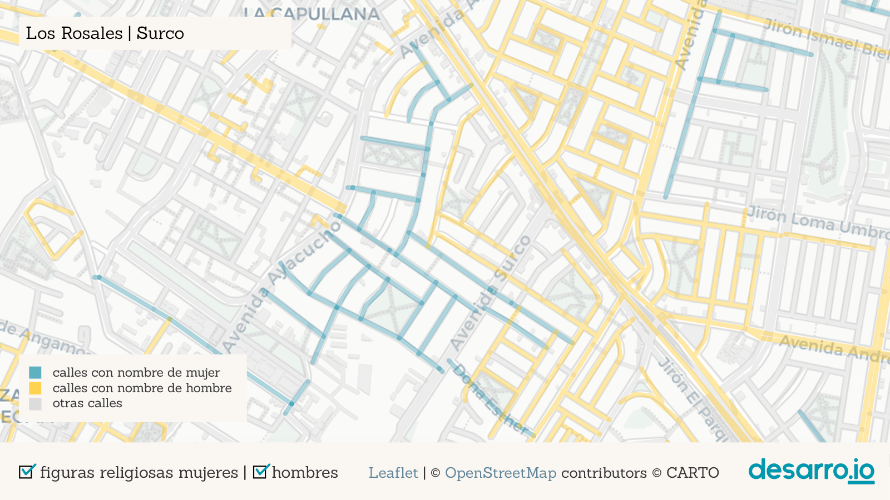
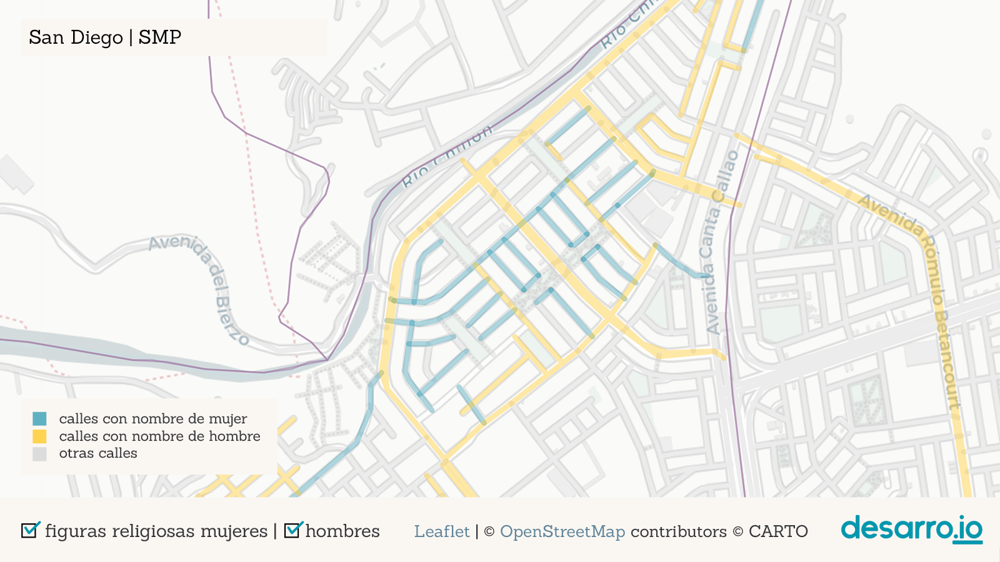
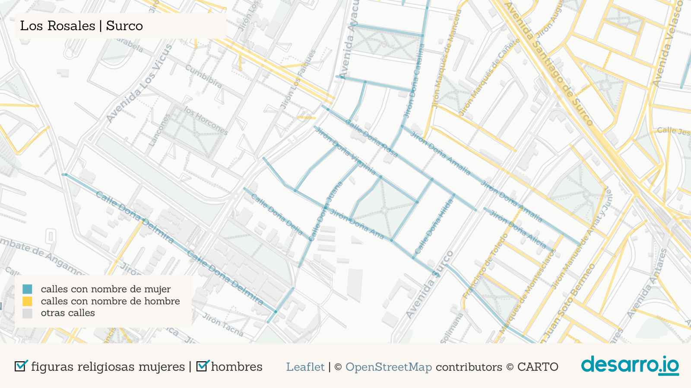
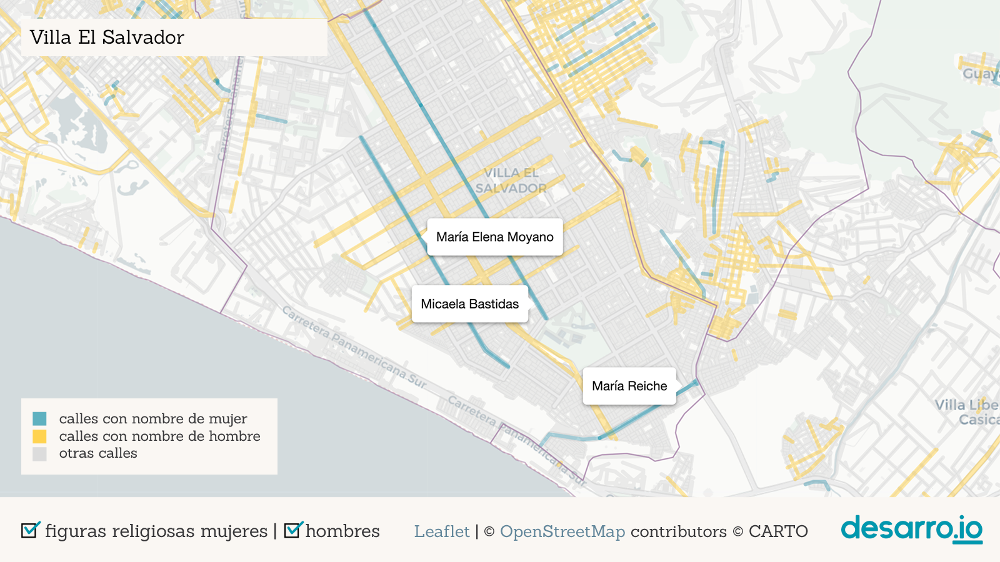

# Tweet

1  
¿Dónde están las calles con nombres de mujeres en Lima y Callao? ¿quiénes son esas mujeres en nuestra historia? ¿qué roles representan? Acompáñanos en este recorrido por la ciudad y las mujeres que nombran sus calles.  

   
  
2  
Hicimos un mapa interactivo para explorar las calles de la ciudad con nombres de mujeres. Fíjate que son muy pocas las calles en azul (con nombres de mujeres) en comparación con las amarillas (hombres). Las calles grises no representan nombres de personas.  

   

3  
A pesar de que son pocas, se notan algunas aglomeraciones de calles de mujeres 🔎. Pando 3era etapa (frente a la @pucp), Los Rosales (@munisurco1), Palao y San Diego (@Munismp), Los Sauces (@MuniAteOficial), Infantas (Los Olivos) y otras.  

  

  

  

   

4  
La aglomeración más grande es la de Pando 3era etapa en Cercado de @munilima. Medio km2 de calles con nombres de santas (Santa Teodosia, Santa Gertrudis, Santa Bernardita, etc.), pero el parque más grande del barrio tiene nombre de hombre: Carlos. 😑  

  

5  
Otras pequeñas aglomeraciones en San Martín de Porres, Ate y Los Olivos también corresponden únicamente a nombres de santas.

6  
La segunda aglomeración más grande está en la urb. Los Rosales (@munisurco1). Este es el barrio de las "doñas" (Doña Rosa, Doña Amalia, Doña Juana...). La etimología de “doña” refiere a “domina” (señora, dueña de casa), y probablemente cuando la escuchamos pensamos en una mujer casada.  

7  
Es revelador que las dos aglomeraciones más grandes de calles con nombres de mujeres en la ciudad rescatan principalmente dos dimensiones: la religiosa/la santidad ⛪ y la doméstica/el rol de esposa 🏠. 

8  
La presencia de figuras femeninas religiosas es muy fuerte entre las calles de @MuniLima y @RegionCallaoPe que tienen nombre de mujer. Fíjate cómo cambia el mapa cuando desactivamos los nombres de personajes religiosas

9 
De hecho, este reportaje de @rpp_pe y @M_Barrenechea muestra que el 57% de calles nombradas como mujeres en Lima corresponde a figuras del ámbito religioso. https://rpp.pe/p/1027018 y nos cuenta un poco sobre las ocupaciones de las mujeres representadas en nuestras calles.

10  
¿Pero además de religiosas, qué otras mujeres son reconocidas en nuestros barrios? Uno de los vecindarios más interesantes es Pando 7ma Etapa (@Muni_San_Miguel cerca de av. Universitaria, y La Marina)...

11  
En este barrio encontramos un grupo de notables mujeres que te invitamos a conocer: Margarita Práxedes (pionera del feminismo peruano), Martha Egúsquiza, Beatriz Cisneros, María Escobar, Luisa Dammert (promotora del voto femenino en XXX)...

12  
Cerca del Óvalo Naranjal hay otro pequeño grupo notable de calles, en este caso de mujeres vinculadas a la educación, donde se encuentran Elvira García, Mercedes Indacochea, Teresa Gonzáles de Fanning y Esther Salgado.

13  
Otro caso interesante es el de @VesMuni, que aunque no tiene muchas calles con nombre de mujer, tiene 3 largas avenidas en memoria de Micaela Bastidas, María Reiche y María Elena Moyano, esta última estrechamente vinculada a la historia del distrito.

14  
También llama la atención que en la supuesta "Lima Moderna" haya muy pocas calles con nombre de mujer: solamente 1 en @munijesusmaria; 3 en @Munimiraflores, @muni_lince, @MuniDeMagdalena y @munibarranco; 8 en @munisanisidro (que, sin contar santas, se reducen a casi la mitad)

15  
Comparando con la expansión de la ciudad (Metzger y otros, 2015) vemos que la ciudad urbanizada hasta los 50 tiene muchos nombres de personas, principalmente hombres, pero la ciudad más nueva parece optar nombres más neutrales (fechas, lugares, números, plantas, profesiones...)  

16  
Nombrar una calle es honrar lugares, personas, hechos o cosas que queremos mantener en nuestra memoria colectiva y preservar en el tiempo. ¿A cuántas mujeres ha reconocido Lima en sus 490 años de fundación española? XXX ¡Menos de una por año!

17  
El Perú y el mundo tienen muchísimas mujeres con trayectorias destacadas que merecen ser recordadas. Muchas de ellas, además, son de nuestra ciudad y nuestros distritos. Nos toca exigir a nuestras autoridades que sean reconocidas y que tengamos más espacios para recordarlas y resaltar su importancia en nuestra sociedad.
  
18  
¿Quieres ver si hay calles con nombre de mujer por tu barrio? Fíjate cuáles son en nuestro mapa interactivo aquí 👉 [LINK]
Seguramente conoces muchas mujeres que merecen una calle. ¡Cuéntanos quiénes serían!

19  
Este mapa fue una idea de @odaltomate 👏 y ejecutada junto al equipo de @desarro_io 🤝. Los nombres de calles son de @openstreetmap 🔎, el mapa se hizo con @leafletJS 🍃 y tiles 🗺️ de @carto. 

20  
Si te interesó el tema date una vuelta por "Las calles de las mujeres" de @geochicas, que identifican las calles en distintas ciudades latinoamericanas 👏👏👏 y enlaza a las biografías disponibles en Wikipedia 👍

21
y revisa también el libro "Mujeres con Calle", en el que alumnes del colegio José Antonio Encinas recopilan biografías sobre Mariana Echevarría, Justa García Robledo, Ernestina Zamorano y Bartola Sánchez Dávila. https://issuu.com/elingeniosocorreo/docs/mujeres_con_calle

22
Refe:
Metzger, P., Gluski, P., Robert, J., & Sierra, A. (2015). Atlas problemático de una metrópoli vulnerable. Desigualdades urbanas en Lima y Callao. Lima: @IFEAPeru. https://www.ifea.org.pe/libreria/travaux/331/pdf/atlas-problematico-es.pdf

# La yapa

18  
'Los nombres de las calles despliegan una “política de la memoria” orientada a que la ciudadanía guarde recuerdo y agradezca a sus compatriotas más ilustres...' Dice Gonzalo Portocarrero https://elcomercio.pe/opinion/columnistas/nombres-calles-gonzalo-portocarrero-noticia-lima-calles-avenidas-479334-noticia/

19
Y además de sesgos de género, los nombres de calles pueden mostrar también la falta de reconocimiento de algunos sectores de la sociedad en detrimento de otros. El propio Gonzalo señala una "relativa ausencia de personajes andinos" y señala también

20
la persistencia de una calle como Los Conquistadores, en @munisanisidro, que "supone una identificación con una tropa de invasores y saqueadores que pretendieron convertirse en los dueños del Tahuantinsuyo".

21 Fuera del país, @TheMelBanci y otros exploran también sesgos de género, identifican las profesiones consideradas de élite y la influencia del extranjero en Paris, Viena, Londres y Nueva York, a partir del análisis de los nombres de las calles.

20 y @Deirdre_Mask en su libro "The Adress Book" muestra casos alrededor del mundo sobre como los nombres de calles premiten observar también sesgos de clase o raza, estigmatización, identidad y poder https://www.deirdremask.com/. 

10  

Algunos de los nombres más usados para calles muestran también diferencias entre los roles valorados en hombres y en mujeres. XXXXXXX

  

11 [Creo que este no va, a menos que se filtre mejor ya que el número de mujeres únicas está sobreestimado en este calculo]  
También encontramos, además, que las calles de Lima y Callao mencionan a 138 figuras religiosas mujeres y 261 mujeres de otros ámbitos.
