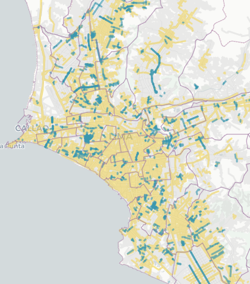

# Tweet

1  
Menos del 2% de las calles de Lima y Callao tienen nombre de mujeres ¿dónde están esas calles? ¿quiénes son esas mujeres? ¿qué roles representan? Acompáñanos en este recorrido por la ciudad y las mujeres que nombran sus calles.  

   
  
2  
Por cada calle con nombre de mujer hay casi 10 nombradas como hombres 🙄. Fíjate que son muy pocas las calles en azul (mujeres) en comparación con las amarillas (hombres). Las calles grises no representan nombres de personas.  

   

3  
A pesar de que son pocas, se notan algunas aglomeraciones de calles de mujeres 🔎. Pando 3era etapa (frente a la @pucp), Los Rosales (@munisurco1), Palao y San Diego (@Munismp), Los Sauces (@MuniAteOficial), Infantas (Los Olivos) y otras.  

  

  

  

   

4  
La aglomeración más grande es la de Pando 3era etapa en Cercado de @munilima. Medio km2 de calles con nombres de Santas (Santa Teodosia, Santa Gertrudis, Santa Bernardita, etc.) El parque más grande del barrio tiene nombre de hombre: Carlos. 😑  

  

5  
Otras aglomeraciones de cierto tamaño en SMP, Ate y los Olivos también corresponden únicamente a nombres de santas.

6  
La segunda aglomeración más grande es la urb. Los Rosales (@munisurco1). Este es el barrio de las "doñas" (Doña Rosa, Doña Amalia, Doña Juana...). La etimología de “doña” refiere a “domina” (señora, dueña de casa), y probablemente cuando la escuchamos pensamos en una mujer casada.  

7  
Es revelador que las dos aglomeraciones más grandes de calles con nombres de mujeres rescatan principalmente dos dimensiones: la religiosa/la santidad ⛪ y la doméstica/el rol de esposa 🏠. 

8  
La presencia de figuras religiosas es muy fuerte entre las calles de @MuniLima y @RegionCallaoPe que tienen nombre de mujer. Fíjate cómo cambia nuestro mapa interactivo cuando desactivamos los nombres de personajes religiosas

9 
De hecho, este interesante reportaje de @rpp_pe y @M_Barrenechea muestra que el 57% de calles de mujeres en Lima corresponde a figuras del ámbito religioso. https://rpp.pe/p/1027018 y nos cuenta un poco sobre ls ocupaciones de las mujeres representadas en nuestras calles.

10 [Creo que este no va, a menos que se resuelva bien lo de los segmentos. Además habría que eliminar angelica gamarra que es en realidad una sola calle]  
Entre las 20 mujeres más usadas para nombrar calles (conteo de segmentos) 11 son santas (Santa Rosa de Lima es la principal). Las demás son mujeres vinculadas a la independencia, con excepción de Flora Tristán.  

  

11 [Creo que este no va, a menos que se filtre mejor ya que el número de mujeres únicas está sobreestimado en este calculo]  
También encontramos, además, que las calles de Lima y Callao mencionan a 138 figuras religiosas mujeres y 261 mujeres de otros ámbitos.

11  
¿Pero además de religiosas, a qué otras mujeres reconocemos en nuestros barrios? Uno de los vecindarios más interesantes es Pando 7ma Etapa (@Muni_San_Miguel alrededor de av. Universitaria, entre La Marina y la Costanera)...

12  
En este barrio encontramos un grupo de notables mujeres que te invitamos a conocer: Margarita Praxedes (pionera del feminismo peruano), Martha Egúsquiza, Beatriz Cisneros, María Escobar, Luisa Dammert (promotora del voto femenino en XXX)...

13  
Cerca del Óvalo Naranjal hay otro pequeño grupo notable de calles, en este caso de mujeres vinculadas a la educación, donde se encuentran Elvira García, Mercedes Indacochea, Teresa Gonzáles de Fanning y Esther Salgado.

14  
Otro caso interesante es el de @VesMuni, que aunque no tiene muchas calles con nombre de mujer, tiene 3 largas avenidas en reconocimiento de Micaela Bastidas, María Reiche y María Elena Moyano, esta última estrechamente vinculada a la historia del distrito.

15  
También llama la atención que en la supuesta "Lima Moderna" hay muy pocas calles con nombre de mujer: solamente 1 en @munijesusmaria; 3 en @Munimiraflores, @muni_lince, @MuniDeMagdalena y @munibarranco; 8 en @munisanisidro (que se reducen a casi la mitad sin contar santas)

16  
Nombrar una calle suele significar un reconocimiento a lugares, personas o hechos que queremos mantener en nuestra memoria colectiva y preservar en el tiempo. ¿A cuántas mujeres hemos reconocido en 490 años de fundación española? ¡Menos de una por año!

17  
Tenemos muchísimas mujeres con trayectorias destacadas en todos los distritos de nuestra ciudad. Nos toca exigir a nuestras autoridades que sean reconocidas y que tengamos más espacios para recordarlas y resaltar su importancia en nuestra sociedad.

18  
¿Quieres ver si hay calles con nombre de mujer por tu barrio? Fíjate en nuestro mapa interactivo aquí 👉 [LINK]
Seguramente conoces muchas mujeres que merecen una calle. ¡Cuéntanos quiénes serían!

19  
Este mapa fue una idea de @odaltomate 👏 y ejecutada junto al equipo de @desarro_io 🤝. Los nombres de calles son de @openstreetmap 🔎, el mapa se hizo con @leafletJS 🍃 y tiles 🗺️ de @carto

Referencias:

Luisa Dammert:
https://www.mimp.gob.pe/webs/mimp/sispod/pdf/89.pdf 
https://blog.derrama.org.pe/y-quien-fue-juana-alarco-de-dammert/

Práxedes
https://revistas.upch.edu.pe/index.php/AH/article/view/4021

