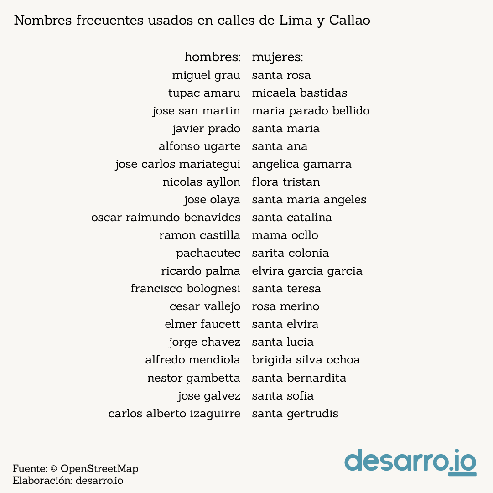
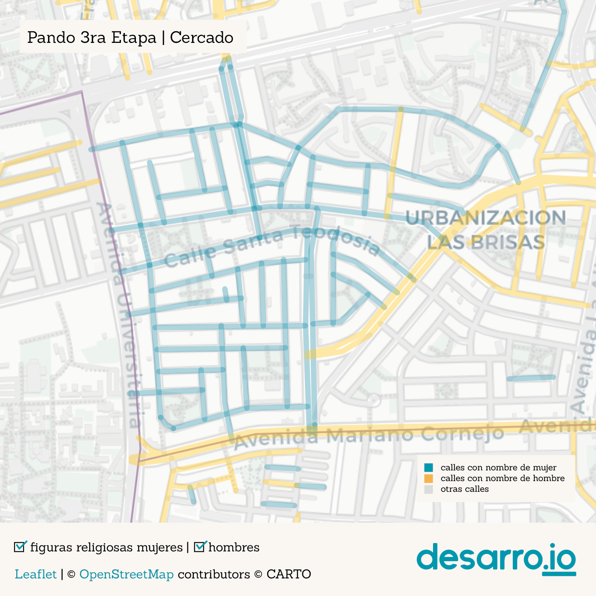
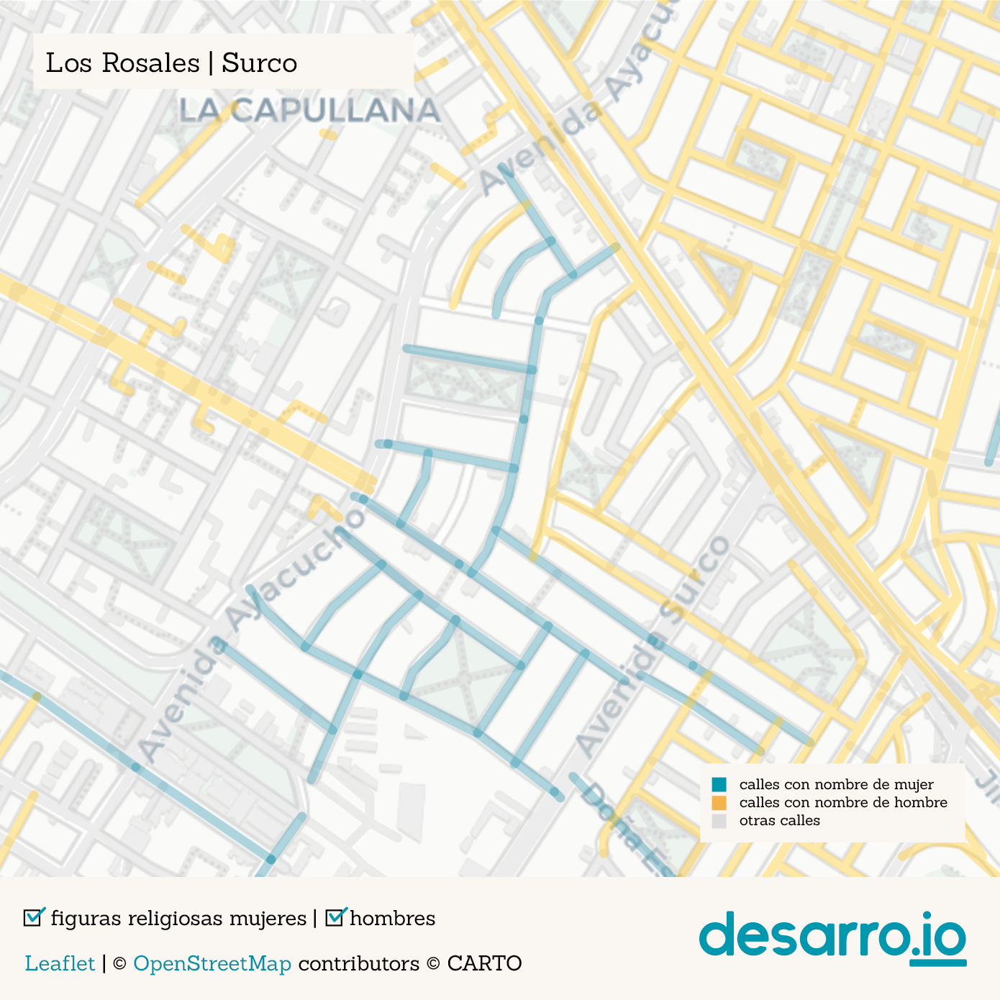
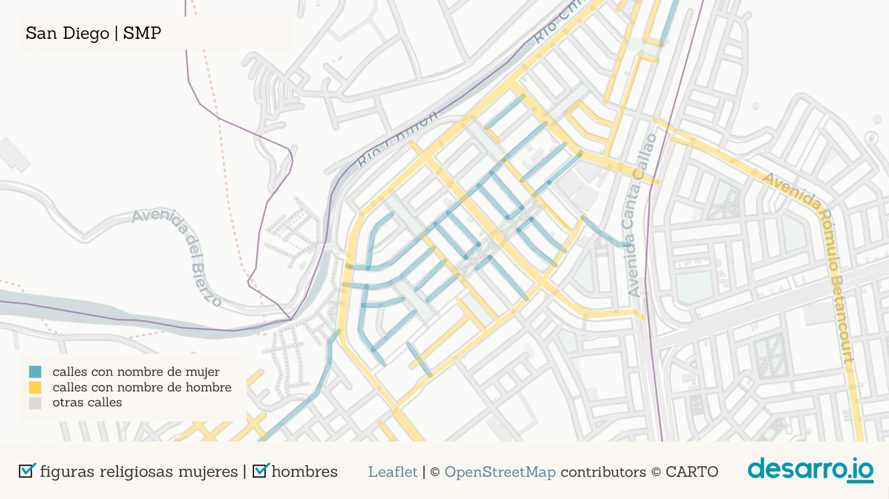
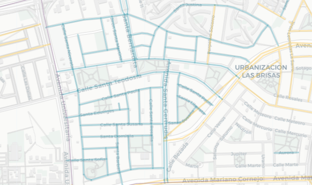
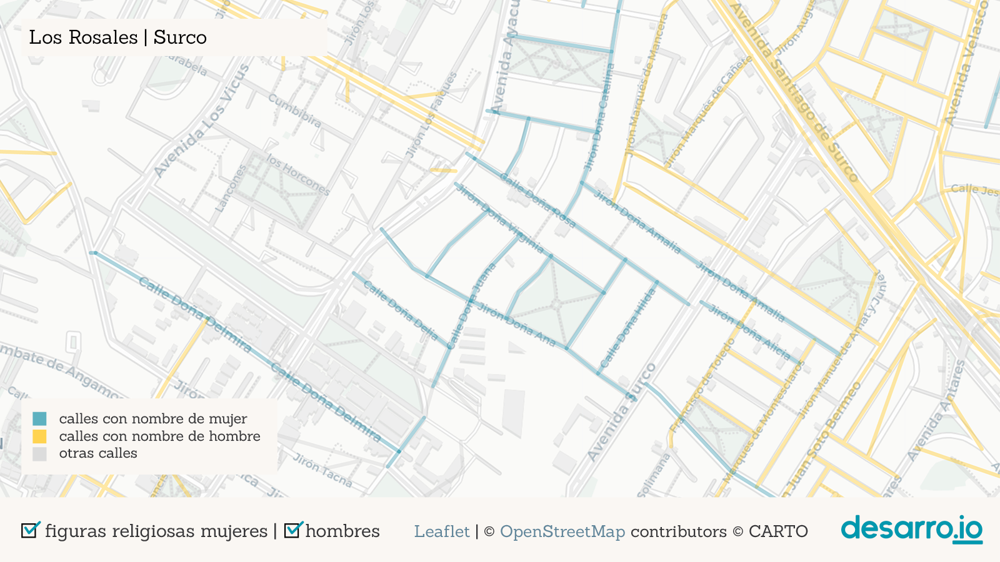
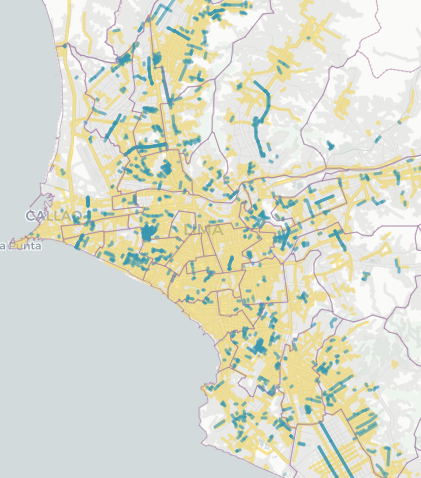
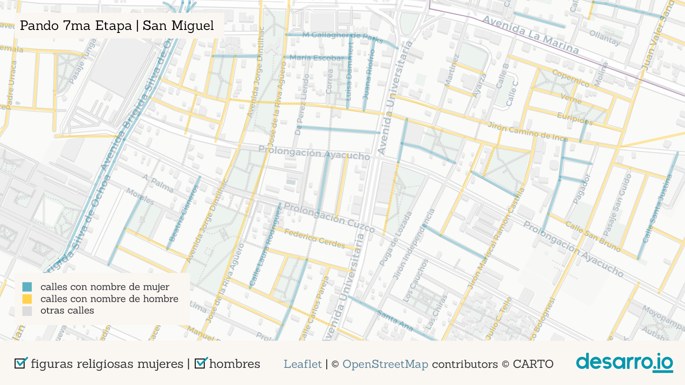
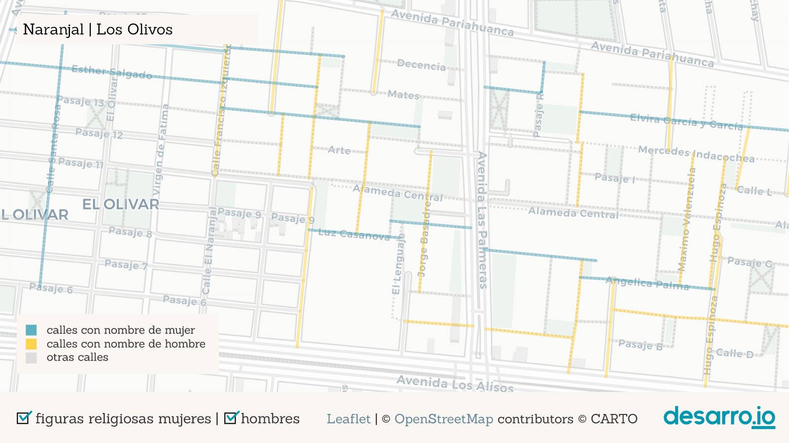
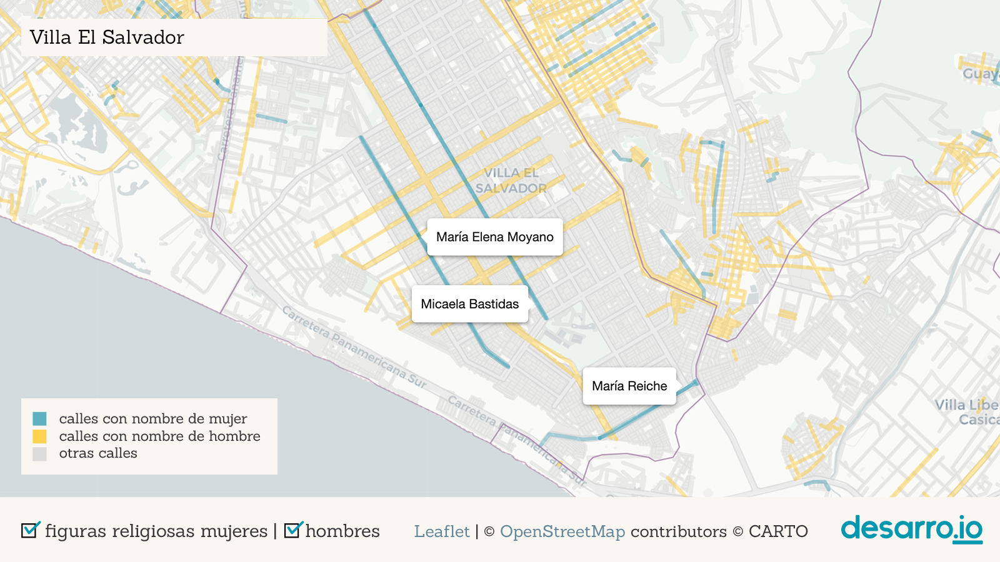

```{r setup, include=FALSE}
knitr::opts_chunk$set(echo = TRUE)
library(sf)
library(leaflet)
library(dplyr)
library(stringr)
library(ggplot2)
library(readr)
```

```{r import-geodata, include=FALSE}
females <-
  st_read("data/gdb_females.geojson", quiet = TRUE) %>% select(7, 22)
males <-
  st_read("data/male_coll_all_simp10.geojson", quiet = TRUE) %>% select(7)
not <-
  st_read("data/not_sel_coll_all_simp10.geojson", quiet = TRUE)
distritos <-
  st_read("data/distritos.geojson", quiet = TRUE) %>% select(1:6) %>% filter(IDDPTO == "07" |
                                                                               IDPROV == "1501")
```

```{r import-data, include=FALSE}
db_males <- read_csv("gdb_males.csv", col_types = cols(X1 = col_skip(), osm_id = col_skip(), railway = col_skip(), amenity = col_skip(), operator = col_skip(), parking = col_skip(), surface = col_skip(), tunnel = col_skip(), oneway = col_skip(), geometry = col_skip(), bridge = col_skip(), smoothness = col_skip(), width = col_skip(), capacity = col_skip(), layer = col_skip(),  public_tra = col_skip(), aeroway = col_skip(), building = col_skip(),  barrier = col_skip(), names = col_skip(), genero = col_character(),  `_merge` = col_skip()))

db_not <- read_csv("gdb_not.csv",  col_types = cols(X1 = col_skip(), osm_id = col_skip(), railway = col_skip(), amenity = col_skip(), operator = col_skip(), parking = col_skip(), surface = col_skip(), tunnel = col_skip(), oneway = col_skip(), geometry = col_skip(), bridge = col_skip(), smoothness = col_skip(), width = col_skip(), capacity = col_skip(), layer = col_skip(),  public_tra = col_skip(), aeroway = col_skip(), building = col_skip(),  barrier = col_skip(), names = col_skip(), genero = col_character(),  `_merge` = col_skip()))
```

```{r clean-data, include=FALSE}
females <- females %>%
  filter(!str_detect(name, "Florencia|Cordillera Blanca|Nevado Sara Sara|América|La Luz|Rio Santa|Marbella|Bajada de Agua Dulce|Tingo|La Marina|Libertad|la Marina|Esperanza|Irlanda|Agua Marina|Río Santa|Esmeralda|Villa Maria|Villa María|Las Mercedes|La Victoria|La Merced|Belén|Mayor Arce de la Oliva|Arnaldo Márquez|Belen|Alheli|de las Mercedes|Vila Mercedes|Franciso de Paula Ugarriza|Agua Dulce|Galvez Barrenechea|Pissarro|Stowe|Río Elba|Talavera de la Reina|El Palo Rosa|Laurel Rosa|La Calera de la Merced|Keller|Coral|Arnaldo Panizo|Villa Mercedes|La Estrella|Antinio Bastidas|Aguada Blanca|La Caridad|A La Rosa|Mara Caibo|Mar Coral|San Teresita|Torre Blanca|Bella Luz|Luz de Luna|Rio Elba|Estrella|Torres de la Merced|Merino Reyna Oeste|Estrella Polar|Sara Sara|Señor de la Soledad|Puente America|America Unamarca|Palmira|Merced|Cristal|Meier|Merced|Cerro Paloma|J.C. María Tegui|El Dulce|Cielo Punko|Caridad|Azucena|La Veronica|María Tegui|Iris|Arnaldo Marquez|Arco Iris|Margarita|La Perla|Fatima|Isis|Barrenechea|Reyna Talavera|America|Soledad|La Soledad|Las Nieves|Alma")) %>% 
  mutate(name = str_replace_all(name, pattern = c('Calle ' = "", 'Pasaje ' = "", 'Avenida ' = "", 'Jirón ' = "", 'Av ' = "", 'Malecón ' = "", 'Malecon ' = "", 'Salida a ' = "", 'Puente ' = "", 'Alameda ' = "", 'Ovalo ' = "" )))

females_notrel <- females %>% filter(!str_detect(name, "Sor|Santa|Beata|Virgen|sor|santa |beata|virgen|María Auxiliadora"))
females_rel <- females %>% filter(str_detect(name, "Sor|Santa|Beata|Virgen|sor|santa |beata|virgen|María Auxiliadora"))

db_females <- females %>% st_drop_geometry() 
db_males <- db_males %>% select(name, highway, genero) %>% 
  mutate(name = str_replace_all(name, pattern = c('Calle ' = "", 'Pasaje ' = "", 'Avenida ' = "", 'Jirón ' = "", 'Av ' = "", 'Malecón ' = "", 'Malecon ' = "", 'Salida a ' = "", 'Puente ' = "", 'Alameda ' = "", 'Ovalo ' = "" ))) 
db_not <- db_not %>% select(name, highway, genero) %>% 
  mutate(name = str_replace_all(name, pattern = c('Calle ' = "", 'Pasaje ' = "", 'Avenida ' = "", 'Jirón ' = "", 'Av ' = "", 'Malecón ' = "", 'Malecon ' = "", 'Salida a ' = "", 'Puente ' = "", 'Alameda ' = "", 'Ovalo ' = "" )))
db_all <- bind_rows(db_females, db_males, db_not)
db_all$genero <- as.factor(db_all$genero)
levels(db_all$genero) <- c("mujeres", "hombres", "ninguno")
```

::: {.bajada}
Solo 406 mujeres tienen calles con sus nombres en Lima y Callao. ¿Quiénes son esas mujeres en nuestra historia? ¿qué roles representan? ¿dónde están esas calles? Acompáñanos en este recorrido por la ciudad y las calles que llevan sus nombres.
:::  
  
::: {.bajada}
8 de marzo, 2022
:::   
  
<br/><br/>  

```{r map, echo = FALSE}
lw <- 3 # set line weight in pixels
lo <- 0.4 # set line opacity
#groups <- c("figuras religiosas mujeres" <- "<font face='Gulim'>figuras religiosas mujeres</font>",
#            "hombres" <- "<font face='Gulim'>hombres</font")
m <- leaflet(width = "100%", options = leafletOptions(minZoom = 10)) %>% 
  setView(-77.022933, -12.068522, zoom = 11) %>%
  setMaxBounds(lng1 = -77.301865, lat1 = -12.525597, lng2 = -76.6, lat2 = -11.56)%>%
  addProviderTiles(providers$CartoDB.Positron) %>% 
  addPolylines(data = not, weight = lw, color = "#D0D0D0", opacity =lo, group = "otras calles") %>%
  addPolylines(data = males, weight = lw, color = "#f1c628", opacity =lo, group = "hombres") %>%
  addPolylines(data = females_rel, weight = lw, color = "#5297ac", opacity =lo, group = "figuras religiosas mujeres", 
               label = females_rel$name) %>%
  addPolylines(data = females_notrel, weight = lw, color = "#5297ac", opacity =lo, group = "mujeres no religiosas", 
               label = females_notrel$name) %>%
  addPolygons( data = distritos, weight = 1, color = "#967aa1", group = "distritos", fill=FALSE) %>%
  addLegend( position = "bottomright", opacity = 0.75, 
             labels = c("calles con nombre de mujer", "calles con nombre de hombre", "otras calles", "límite distrital"),
             colors = c("#5297ac", "#f1c628", "#D0D0D0", "#967aa1")) %>% 
  addLayersControl( overlayGroups = c("figuras religiosas mujeres","mujeres no religiosas", "hombres"),
                    options = layersControlOptions( collapsed = FALSE))
```

```{r plot-leaflet, out.width="1000px", echo=FALSE}
m
```

Un vistazo general de la ciudad nos muestra que existe un patrón en la asignación de calles de Lima y Callao: las mujeres no son tan celebradas como los hombres. Mientras las calles de la ciudad rinden homenaje a 3448 hombres, solamente 406 mujeres fueron reconocidas para ello. Más de 8 hombres por cada mujer.  

<center>

{height=400px}  

</center>

A pesar de eso, se pueden encontrar algunas aglomeraciones de calles que recibieron nombre de mujeres como: Pando 3era etapa (frente a la PUCP), Los Rosales (Surco), Palao y San Diego (San Martín de Porres), Los Sauces (Ate), Infantas (Los Olivos) y otras.

<center>

{width=400px}&nbsp;&nbsp;
{width=400px}  

</center>

<center>

{width=400px}&nbsp;&nbsp;
{width=400px}   

</center>

Una de las aglomeraciones más grandes de calles con nombres femeninos es la de Pando 3era etapa en Cercado de Lima. Se trata de medio km2 de calles con nombres de Santas (Santa Teodosia, Santa Gertrudis, Santa Bernardita, etc.). En medio de todas esas calles, al parque más grande del barrio se le asignó un nombre masculino y laico: Carlos. Otras pequeñas aglomeraciones de calles con nombres femeninos aparecen en San Martín de Porres, Ate y Los Olivos pero corresponden otra vez a nombres de santas.  

<center>

{height=300px}  

</center>

La segunda aglomeración más grande está en la urb. Los Rosales, en Santiago de Surco. Se trata de un grupo de calles con nombres de mujeres pero sin apellidos, y que vienen precedidos por la palabra “doña” (Doña Rosa, Doña Amalia, Doña Juana...). La etimología de “doña” viene del latín “domina” (dueña de casa, mujer casada). Al tratarse de mujeres anónimas, ninguna cuenta con una biografía.

<center>

{height=300px}  

</center>

Es revelador que las dos aglomeraciones más grandes de calles con nombres de mujeres en la ciudad rescatan principalmente dos dimensiones: la religiosa/la santidad y la doméstica/el rol de esposa. Existe una fuerte presencia de calles con nombres femeninos de religiosas entre las calles de Lima y Callao. Fíjate cómo cambia nuestro mapa interactivo cuando desactivamos los nombres de mujeres religiosas. De hecho,  el 39% de mujeres mencionadas en calles de Lima corresponde a santas, mientras que en el caso de los hombres, solamente el 5% son santos, lo que nos muestra que la valoración de las ocupaciones masculinas y femeninas es diferente.

<center>

{width=300px}

{width=300px}

</center>

Además de religiosas, ¿qué otros aportes de las mujeres son reconocidos en las calles? Fijémonos en Pando 7ma Etapa (San Miguel, cerca de av. Universitaria, y La Marina). En este barrio encontramos calles con nombres de mujeres notables que te invitamos a conocer: [Margarita Práxedes](https://es.wikipedia.org/wiki/Margarita_Pr%C3%A1xedes_Mu%C3%B1oz) (pionera del feminismo peruano) y [Luisa Dammert](https://www.mimp.gob.pe/webs/mimp/sispod/pdf/89.pdf) (promotora del voto femenino en el siglo XX). Además de Martha Egúsquiza, Beatriz Cisneros y María Escobar. Ninguna de ellas está reseñada en Wikipedia.

<center>

{height=300px}  

</center>


Cerca del Óvalo Naranjal, en Los Olivos, hay un pequeño grupo de calles con nombres de mujeres activistas por la educación de la mujer peruana, como [Elvira García](https://es.wikipedia.org/wiki/Elvira_Garc%C3%ADa_y_Garc%C3%ADa), [Mercedes Indacochea](https://es.wikipedia.org/wiki/Mercedes_Indacochea), [Teresa Gonzáles de Fanning](https://es.wikipedia.org/wiki/Teresa_Gonz%C3%A1lez_de_Fanning) y [Esther Salgado](https://sites.google.com/site/jlcapristano/biografia#:~:text=Se%20adjudica%20el%20nombre%20de,1974%2C%20falleciendo%20ese%20mismo%20a%C3%B1o.).

<center>

{height=300px}  

</center>

Otro caso destacable es el de Villa el Salvador, que tiene 3 largas avenidas en memoria a [Micaela Bastidas](https://es.wikipedia.org/wiki/Micaela_Bastidas), [María Reiche](https://es.wikipedia.org/wiki/Maria_Reiche) y [María Elena Moyano](https://es.wikipedia.org/wiki/Mar%C3%ADa_Elena_Moyano), esta última estrechamente vinculada a la historia del distrito. Sin embargo, en el mismo distrito existen pocas calles a las que se les otorgó nombre de mujer.

<center>

{height=300px}
</center>

También llama la atención que en la “Lima Moderna” existan pocas calles designadas con nombres de mujeres: solamente 1 en Jesús María; 3 en Miraflores, Lince, Magdalena y Barranco; y 8 en San Isidro (que se reducen a casi la mitad si no contamos santas). Sin embargo, llama la atención que casi ninguna de estas mujeres fue vecina o está relacionada con la historia del distrito. 

Al nombrar una calle creamos una narrativa de cómo es un lugar: le damos carácter y recordamos la historia. En sus 490 años de fundación española, ¿a cuántas mujeres nos invita a recordar Lima? ¿A cuántas reconoce el país en sus 200 años de Independencia? ¡Menos de dos por año!

En el Perú existe una larga lista de mujeres excepcionales y de trayectorias destacadas que urge visibilizar y recordar. Nos toca exigir a las autoridades que sean reconocidas en los espacios públicos y resaltar sus aportes a la sociedad. ¿Qué nombres de mujeres peruanas quisieras ver en una calle? ¡Cuéntanos quiénes serían!

* * *  

### Fuentes de datos  

::: {.cierre}
Los nombres de calles son de [OpenStreetMap](https://www.openstreetmap.org/) 🔎, el mapa se hizo con [Leaflet](https://leafletjs.com/) 🍃 y tiles 🗺️ de [Carto](https://carto.com/).  
:::  

### Nota metodológica  

::: {.cierre}
La clasificación fue realizada detectando la presencia de nombres populares de hombres y mujeres en la información pública disponible en Open Street Maps, y realizando ajustes manuales sobre esos resultados. Algunas calles pueden haber sido clasificadas como "sin nombres de personas" debido a errores u omisiones involuntarias en este método o a errores ortográficos en los datos iniciales.
Nuestro código es de libre acceso bajo una licencia MIT en [este repositorio](https://github.com/desarroio/genero-calles).  
:::  

### Bibliografía y otros recursos  

::: {.cierre}  
El proyecto [Las calles de las mujeres](https://geochicasosm.github.io/lascallesdelasmujeres/), de Geochicas, identifica las calles con nombres de mujeres en distintas ciudades latinoamericanas y enlaza a las biografías disponibles en Wikipedia.

[Este reportaje de RPP y Melissa Barrenechea](https://rpp.pe/lima/actualidad/reportaje-cuantas-calles-de-lima-tienen-nombre-de-mujer-noticia-1027018?ref=rpp) muestra que el 57% de calles asignadas a nombres de mujeres en Lima corresponde a figuras del ámbito religioso, y da cuenta de las ocupaciones de estas mujeres conmemoradas con una calle.  

En el libro [Mujeres con Calle](https://issuu.com/elingeniosocorreo/docs/mujeres_con_calle), alumnes del colegio José Antonio Encinas recopilan biografías sobre Mariana Echevarría, Justa García Robledo, Ernestina Zamorano y Bartola Sánchez Dávila. 

[Gonzalo Portocarrero](https://elcomercio.pe/opinion/columnistas/nombres-calles-gonzalo-portocarrero-noticia-lima-calles-avenidas-479334-noticia/) dice que 'Los nombres de las calles despliegan una “política de la memoria” orientada a que la ciudadanía guarde recuerdo y agradezca a sus compatriotas más ilustres...', y señala que los nombres de calles pueden mostrar también la falta de reconocimiento de algunos sectores de la sociedad en detrimento de otros. Gonzalo muestra una "relativa ausencia de personajes andinos" y señala también la persistencia de una calle como Los Conquistadores, en San Isidro, que "supone una identificación con una tropa de invasores y saqueadores que pretendieron convertirse en los dueños del Tahuantinsuyo".

Deirdre Mask, en su libro [The Adress Book](https://www.deirdremask.com/) muestra casos alrededor del mundo sobre como los nombres de calles premiten observar también sesgos de clase o raza, estigmatización, identidad y poder. 

Pierre-Nicholas Schwab, en [The feminisation of street names: useful debate or a political artifice?](https://www.intotheminds.com/blog/en/feminisation-street-names/), muestra algunos proyectos de mapeo de calles de mujeres y explora la relevancia de la feminización de los nombres de las calles.

[Esta nota de la BBC](https://www.bbc.com/future/article/20210712-streetonomics-what-our-addresses-say-about-us) reseña [el trabajo de Bancilhon, M., Constantinides, M., Bogucka, E. P., Aiello, L. M., & Quercia, D.](https://journals.plos.org/plosone/article?id=10.1371/journal.pone.0252869&fbclid=IwAR3ooMZQ2iS0Dih1KSMyHBrDkMWt2_syipwp73_6_afE6lpInpNI-yWX5Hk) en el que exploran los sesgos de género, identifican las profesiones consideradas de élite y la influencia del extranjero en Paris, Viena, Londres y Nueva York, a partir del análisis de los nombres de las calles.
:::  

### Créditos  
::: {.cierre}  
Este es un trabajo del equipo de [desarro.io](desaro.io). La idea 
y el prototipo en Python son de [Carla Solis](https://github.com/ccsuehara). El desarrollo web es de [Gonzalo Talavera Forlin](https://gtalavera.github.io/). Los textos, análisis y verificación de datos son de Ioanna Gallo, Daniela Velit y Gonzalo. Las imágenes son de [Carlos Julio San Martín](https://twitter.com/cjmsma). También participaron Luis Eduardo San Martín y Marcy Castro.
:::  
